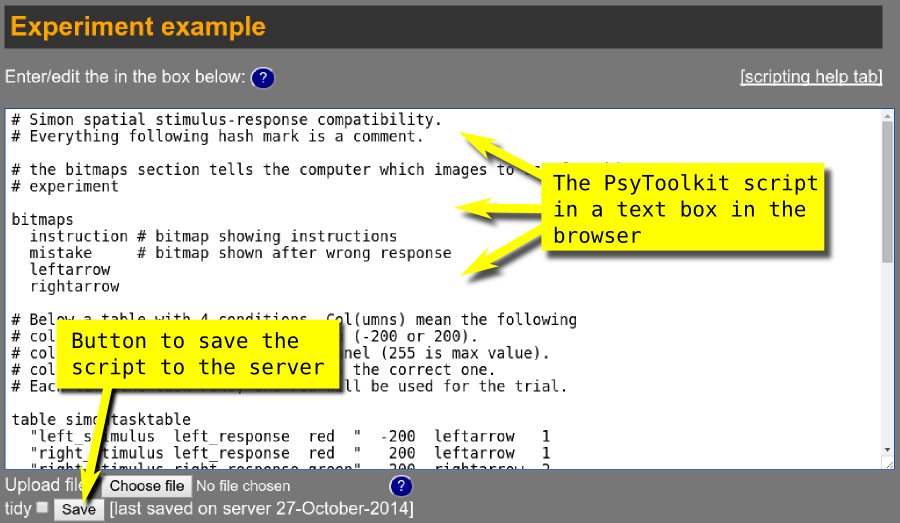
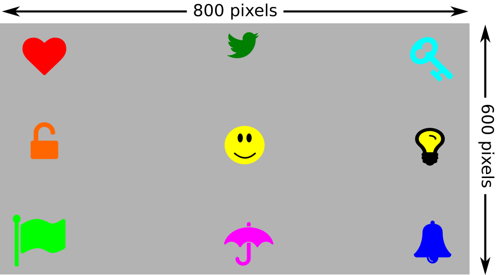
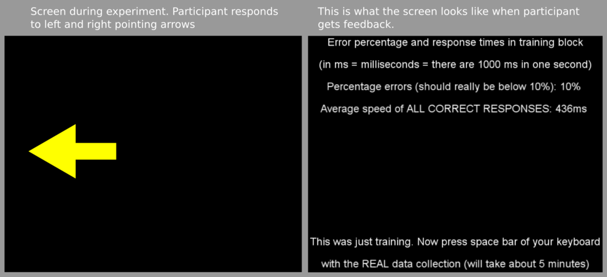
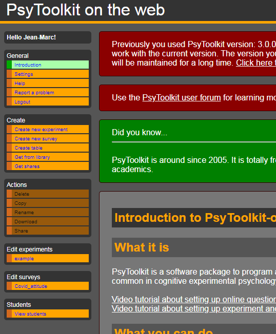
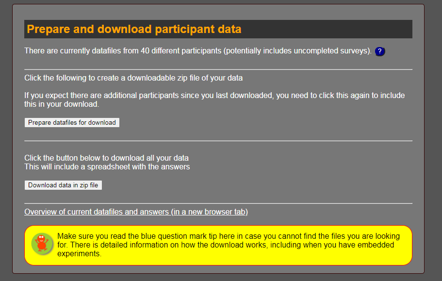

# Programmer des expériences{#s4}

## Les Scripts d'd'expérimentation dans PsyToolkit [](https://www.psytoolkit.org/doc3.2.0/scripting_basics.html){#s4-1}

Les Scripts d'expérimentation est une partie importante de PsyToolkit (à ne pas confondre avec les scripts d'enquête). Le script d'expérimentation indique à l'ordinateur quand et comment montrer les stimuli, comment mesurer les réponses et comment écrire les données dans un fichier de données.

Le script d'expérimentation est comme la programmation d'un ordinateur. Vous ne pouvez l'apprendre qu'en faisant, en regardant des exemples et en étant patient. En fin de compte, il est beaucoup plus souple et plus facile à utiliser que les programmes de type "pointer-cliquer". Au début, il peut cependant sembler beaucoup plus difficile.


### Définition d'un script [](https://www.psytoolkit.org/doc3.2.0/scripting_basics.html#_definition_of_a_script){#s4-1-1}

Un script est essentiellement un simple document textuel. Il contient toutes les informations nécessaires pour mener une expérience. Lorsque vous utilisez PsyToolkit dans le navigateur, le script s'affiche dans une zone de texte (voir image ci-dessous). Tout comme dans un éditeur de texte ordinaire, vous pouvez enregistrer le fichier. Si vous travaillez avec le navigateur, le fichier sera en fait enregistré sur le serveur PsyToolkit, et vous pourrez accéder au fichier partout dans le monde.



> Si vous travaillez hors ligne sous Linux, vous pouvez modifier votre fichier de script dans un éditeur de texte, tel que gedit ou kate ou emacs.

### Étapes typiques d'une expérience [](https://www.psytoolkit.org/doc3.2.0/scripting_basics.html#_typical_steps_in_making_an_experiment){#s4-1-2}

Vous passerez par un certain nombre d'étapes. PsyToolkit entre en jeu après l'étape 2 ci-dessous.

1. Concevez votre expérience sur papier.

* Pensez aux conditions expérimentales dont vous disposez
* Pensez aux instructions et aux stimuli que vous avez
* Écrivez les événements qui se produisent dans le cadre de votre expérience (quand et comment ils doivent se produire, ce que l'on attend des participants, etc.)

2. Créer les stimuli sous forme de bitmaps et/ou de fichiers audio

* Il est recommandé de créer les stimuli sous forme de fichiers images (par exemple, au format png, bmp, jpg). Le logiciel recommandé est le suivant : [www.inkscape.org](www.inkscape.org)

3. Ecrivez le code PsyToolkit. Habituellement, chaque ligne PsyToolkit correspond à un événement des étapes précédentes. Le code peut être écrit dans un navigateur ou dans un éditeur de texte. Le code PsyToolkit est juste un fichier texte combiné avec les fichiers de stimulation.

4. Compilez le code PsyToolkit en une expérience exécutable. Si vous compilez sur un ordinateur Linux, vous pouvez exécuter le code sur un ordinateur local et même utiliser du matériel externe spécial, comme des claviers Cedrus. Si vous compilez dans un navigateur, vous pouvez exécuter le code dans un navigateur et même demander aux gens de participer en ligne.

## Les stimuli dans PsyToolkit [](https://www.psytoolkit.org/doc3.1.0/stimuli.html){#s4-2}

Dans PsyToolkit, il y a des stimuli visuels et auditifs. Les stimuli visuels peuvent être divisés en images bitmap (chargées sous forme de fichiers bitmap dans n'importe quel format bitmap^[Une image bitmap est une image vectorielle. Sur l'ordinateur, elles sont enregistrées dans des fichiers image et portent l'extension/type png, jpg, bmp, gif, etc.]), en rectangles et en texte. Les stimuli auditifs sont simplement des sons (chargés sous forme de fichiers sonores).

### Comment créer des stimuli pour PsyToolkit [](https://www.psytoolkit.org/doc3.1.0/stimuli.html##_how_to_create_stimuli_for_psytoolkit){#s4-2-2}

Il faut créer des stimuli. Par exemple, les stimuli visuels sont simplement des images bitmaps. Vous pouvez en trouver beaucoup sur internet (par exemple, avec Google images, mais assurez-vous que vous travaillez dans le respect de la législation applicable en matière de droits d'auteur). Vous pouvez également utiliser les images numériques de votre appareil photo (elles sont généralement beaucoup plus grandes que la résolution de votre écran, il vous faut donc un logiciel pour les redimensionner).

La taille d'écran par défaut est de 800 par 600 pixels. Vous pouvez la modifier avec l'option résolution
Les images numériques peuvent être lourdes, surtout lorsqu'elles sont prises par un appareil photo numérique. Veillez à vérifier la taille en pixels. Un stimulus typique peut être de l'ordre de 100 par 100 pixels.

Le logiciel recommandé pour créer des stimuli de haute qualité est [Inkscape](http://www.inkscape.org/). Ce logiciel est gratuit, peut être téléchargé, fonctionne sur tous les ordinateurs, est de haute qualité et comporte de nombreux tutoriels. Il faut peut-être une journée pour s'y habituer, mais c'est un temps d'apprentissage bien utilisé^[NdT. Pour ma part, j'ai une préférence, sous windows pour [paint.net](https://paint-net.fr.softonic.com/)].

Pour les stimuli auditifs, vous pouvez utiliser [Audacity](http://audacity.sourceforge.net/), qui est l'un des meilleurs et des plus populaires éditeurs de sons gratuits. Vous pouvez également rechercher des fichiers sonores en ligne et les couper à la bonne durée, et les modifier en utilisant Audacity.

### Comment charger les stimuli [](https://www.psytoolkit.org/doc3.1.0/stimuli.html#_how_to_load_stimuli){#s4-2-3}

Il existe des instructions spéciales pour indiquer à l'ordinateur de charger des stimuli. Il y a une instruction pour les images (bitmaps), les sons et les polices de caractères. Lorsque vous chargez des stimuli, vous pouvez spécifier le nom du stimulus que vous souhaitez utiliser et le nom du fichier. Voici un exemple de chargement de stimuli. Plus tard, vous pourrez vous référer à ces deux fichiers images avec "MyBitmap" et "anotherone".

**Chargement des stimuli visuels, appelés bitmaps**
```
bitmaps
  MyBitmap some_image.jpg
  anotherone bitmaps/anotherimage.png
``` 

Dans l'instruction *bitmaps* de l'exemple, vous avez deux choses. D'abord le nom de l'image tel que vous l'utiliserez dans le code suivant (par exemple, "MyBitmap"), suivi de son nom de fichier.

Si vous utilisez des bitmaps PNG, il vous suffit de donner le nom du PNG sans l'extension, et PsyToolkit reconnaîtra que pour le nom il y aura un nom de fichier sous ce nom avec l'extension PNG. Par conséquent, les fichiers PNG sont les plus pratiques à utiliser.

PNG est le format d'exportation des images par défaut d'Inkscape, un programme fantastique pour dessiner des stimuli.

### Comment présenter les stimuli [](https://www.psytoolkit.org/doc3.1.0/stimuli.html#_how_to_present_stimuli){#s4-2-4}

Dans PsyToolkit, vous pouvez présenter des stimuli dans la session "tâche" en utilisant la commande "show".

**Afficher les bitmaps**
```
task mytask
   show bitmap MyBitmap ## bitmap number 1
   show bitmap anotherone 100 300 ## bitmap number 2
   clear 1
   delay 1000
   clear 2
```  
  
### Système de coordonnées PsyToolkit [](https://www.psytoolkit.org/doc3.1.0/stimuli.html#_psytoolkit_coordinate_system){#s4-2-4}

Dans PsyToolkit, un stimulus visuel est par défaut présenté exactement au centre de l'écran. Si vous souhaitez une position différente de 0,0, vous pouvez présenter les coordonnées x et y comme dans l'exemple ci-dessus (plus d'exemples ci-dessous).

Par défaut, la coordonnée 0,0 réfère au centre de l'écran. Si vous souhaitez que 0,0 soit en haut à gauche de l'écran, vous pouvez le spécifier dans une option, comme dans l'exemple ci-dessous.

**Définir un autre système de coordonnées**
```
options
   origin topleft
```



**Show the stimuli in a task**
````
bitmaps
  heart
  bird
  key
  lock
  smiley
  bulb
  flag
  umbrella
  bell

task test
  show bitmap smiley
  show bitmap heart -300 -200
  show bitmap bird 0 -200
  show bitmap key 300 -200
  show bitmap lock -300 0
  show bitmap bulb 300 0
  show bitmap flag -300 200
  show bitmap umbrella 0 200
  show bitmap bell 300 200
  delay 1000

 block testblock
  tasklist
    test 10
  end
````

Ainsi, la coordonnée x,y 300 200 est présentée en bas à droite et la coordonnée x,y -300 -200 est présentée dans le quadrant supérieur gauche de l'écran. En d'autres termes, les coordonnées négatives réfèrent à la moitié supérieure de l'écran.

J'ai dessiné le smiley et pris les autres images dans le fantastique jeu d'icônes [fontawesome](https://en.wikipedia.org/wiki/Font_Awesome). [Téléchargez ici](http://fontawesome.io/). Le jeu d'icônes fontawesome est livré avec des fichiers SVG, vous pouvez donc les importer dans Inkscape et les agrandir sans perte de qualité. [Lisez une explication sur la mise à l'échelle des images ici](http://www.hiland.com/knowledge-base/bitmap-and-vector-images-understanding-the-difference/).

### Questions de temps [](https://www.psytoolkit.org/doc3.1.0/stimuli.html#_timing_issues){#s4-2-4}

Un moniteur typique se "met à jour" 60 fois par seconde, c'est-à-dire 60 Hz, ou toutes les 17 millisecondes environ. Certains moniteurs spéciaux peuvent faire beaucoup mieux. Sur la version Linux/Desktop, vous pouvez contrôler le timing des stimuli en utilisant la fonction [vsync](#vsync) (qui est activée par défaut et qui est typique des expériences psychologiques cognitives en laboratoire). Dans la version basée sur le web, vous ne pouvez pas faire cela, ce qui signifie que vous ajouterez du bruit à vos données expérimentales.

## Syntaxe pour les feedback [](https://www.psytoolkit.org/doc3.1.0/feedback.html){#s4-3}

Le retour d'information permettra à un participant de donner son avis sur les performances, par exemple sur les temps de réponse moyens dans un bloc. Le retour d'information peut être programmé dans une section "bloc" uniquement (et non sur une base d'essai par essai).

La gestion des feedback n'est pas destiné aux débutants de PsyToolkit. Le feedback est une fonction avancée du codage des expériences PsyToolkit, et vous ne devez l'utiliser qu'une fois que vous avez maîtrisé la programmation des aspects plus basiques de l'expérience. Vous en trouverez de bons exemples dans les expériences téléchargeables dans la [bibliothèque d'expériences](http://www.psytoolkit.org/experiment-library/).


### Contexte [](https://www.psytoolkit.org/doc3.1.0/feedback.html#_background){#s4-3-1}

Les chercheurs pourraient vouloir donner aux participants un retour d'information (feedback) sur leurs performances. Voici quelques raisons de donner un feedback :

* Le feedback peut motiver les participants à répondre plus précisément ou plus rapidement
* Les chercheurs peuvent vouloir utiliser les informations en retour lors de la conception de la tâche (mais ne pas les donner aux participants à la fin)

### Ce dont vous avez besoin pour pouvoir donner un feedback [](https://www.psytoolkit.org/doc3.1.0/feedback.html#_what_you_need_to_be_able_to_give_feedback){#s4-3-2}

Afin d'utiliser un feedback pour les participants, vous devrez vous assurer que vous avez réfléchi aux points suivants :

* Dans quelle police de caractères souhaitez-vous présenter les informations de retour d'information ? Les commentaires utiliseront la première police spécifiée.
* Sur quelles données voulez-vous donner un feedback ? Vous devez vous assurer que vous avez enregistré ces données en utilisant l'instruction "save" dans la description de la tâche.

Quel type de retour d'information souhaitez-vous donner ? Le plus souvent, il s'agit simplement d'indiquer à l'utilisateur le nombre d'erreurs qu'il a commises ou la vitesse moyenne de réponse.

### Syntaxe [](https://www.psytoolkit.org/doc3.1.0/feedback.html#_syntax){#s4-3-3}

Les instructions de retour d'information sont données dans la déclaration "bloc". Dans les exemples ci-dessous, la partie "feedback" des blocs sera cependant indiquée. Vous trouverez un exemple complet en bas de cette page. Vous trouverez des exemples complets dans la bibliothèque d'expériences.
Il y a actuellement 5 composants principaux pour donner un feedback. Il est probablement bon de regarder d'abord l'exemple ci-dessous pour avoir une impression rapide (le codage est souvent appris plus rapidement en regardant les exemples).

* [set](#feedbackset)
* [text](#feedbacktext)
* [lineplot](feedbacklineplot)
* [xyplot](feedbacklineplot)
* [save](feedbacksave)

Elles sont décrites plus en détail ci-dessous.

### text [](https://www.psytoolkit.org/doc3.1.0/feedback.html#_text){#feedbacktext}
Le texte vous permet de présenter des valeurs variables (la commande "set" vous permet de calculer les moyennes, les min, max et les pourcentages des réponses des participants), et plus encore (chaque fonction décrite ci-dessous).

Les guillement autour d'un texte littéral dans un feedback ne sont  pas obligatoires , bien qu'elles soient recommandées. Dans les commandes de  la tâche "show text", les guillemets doivent cependant être utilisés.

**Exemple de texte**

````
feedback
  text  0 -150 "Press space bar to continue"
 end
````

**Exemple de texte** 
 
````
feedback
  set &MyVar perc 10 ; select c4 == 1
  text  0 -150 &MyVar ; prefix "Percentage errors (should really be below 10%):" ; postfix "%"
 end
````
 
 Vous devez renvoyer à la colonne du fichier de données (dans l'exemple où nous sélectionnons la 4ème colonne, le préfixe c indique la colonne. Il s'agit de la colonne du fichier de données et non du tableau !

Le mot-clé select ne fonctionne qu'avec des chiffres, pas avec des noms. Ainsi, si vous voulez sélectionner uniquement les essais d'un certain bloc, ne vérifiez pas cela avec son nom mais avec son numéro. Vous pouvez utiliser BLOCKNUMBER dans la ligne **save** Notez également qu'un message autonome augmente le compteur BLOCKNUMBER.


#### attributs de texte [](https://www.psytoolkit.org/doc3.1.0/feedback.html#_text_attributes)
Vous pouvez aligner le texte à gauche si nécessaire. Vous pouvez utiliser les mêmes attributs de texte dans les expériences. Par exemple :

**Exemple de texte**

````
 feedback
  text color yellow
  text align left
  text  0 0 "Line 1"
  text  0 100 "Line 2 with some more text"
 end
 ````
 
 Un autre exemple de texte
 
 ````
  feedback
  text align center
  text color 00FF00
  text  0 0 "Line 1"
  text  0 100 "Line 2 with some more text"
 end
````
 
### définir des variables [](https://www.psytoolkit.org/doc3.1.0/feedback.html#_set){#feedbackset}

Vous pouvez définir des variables globales (utilisez le signe &). Il s'agit très probablement de variables que vous n'avez pas utilisées dans les tâches ou les blocs, bien que vous puissiez les montrer ici aussi !

Il existe un certain nombre de fonctions que vous pouvez utiliser, chacune étant expliquée par un exemple ci-dessous. La partie "select" d'une ligne "set" dans la section "feedback" vous permet de n'utiliser que les essais de certaines lignes (voir ci-dessous pour plus d'explications)

#### mean [](https://www.psytoolkit.org/doc3.1.0/feedback.html#_mean){#feedbackmean}
Calculez la moyenne

**Exemple avec mean**

````
  feedback
    set &MyVar mean c6 ; select c4 == 1
    text  0 -150 &MyVar ; prefix "Mean response time:" ; postfix "ms."
  end
````
Dans l'exemple ci-dessus, imaginez que la colonne 6 des données contient le temps de réaction et la colonne 4 le statut (la valeur 1 étant correcte, comme c'est le cas par défaut dans PsyToolkit). Dans ce cas, &MyVar sera réglé sur le temps de réaction moyen, mais uniquement pour les essais dans lesquels aucune erreur n'a été commise (car seuls les essais pour lesquels la quatrième colonne est 1 sont pris en compte). 
  
#### min [](https://www.psytoolkit.org/doc3.1.0/feedback.html#_min){#feedbackmin}
Calculez la plus petite valeur

**Exemple avec min **
````
  feedback
    set &MyVar min c6 ; select c4 == 1
    text  0 -150 &MyVar ; prefix "Shortest response time:" ; postfix "ms."
  end
````

Dans l'exemple ci-dessus, imaginez que la colonne 6 des données contient le temps de réaction et la colonne 4 le statut (la valeur 1 étant correcte, comme c'est le cas par défaut dans PsyToolkit). Dans ce cas, &MyVar sera réglé sur le temps de réaction minimum (c'est-à-dire le plus court), mais uniquement pour les essais dans lesquels aucune erreur n'a été commise (car seuls les essais pour lesquels la quatrième colonne est 1 sont pris en compte).

#### Max [](https://www.psytoolkit.org/doc3.1.0/feedback.html#_max){#feedbackmax}

Calucler la plus grande valeur

**Exemple de maximum**

````
  feedback
    set &MyVar max c6 ; select c4 == 1
    text  0 -150 &MyVar ; prefix "Longest response time:" ; postfix "ms."
  end
````
  
Dans l'exemple ci-dessus, imaginez que la colonne 6 des données contient le temps de réaction et la colonne 4 le statut (la valeur 1 étant correcte, comme c'est le cas par défaut dans PsyToolkit). Dans ce cas, &MyVar sera réglé sur le temps de réaction maximum (c'est-à-dire le plus long), mais uniquement pour les essais dans lesquels aucune erreur n'a été commise (car seuls les essais pour lesquels la quatrième colonne est 1 sont pris en compte)

#### sum [](https://www.psytoolkit.org/doc3.1.0/feedback.html#_sum){#feedbacksum}

Calculer la somme des valeurs

**exemple avec sum **
````
  feedback
    set &MyVar sum c6 ; select c4 == 1
    text  0 -150 &MyVar ; prefix "Total response time:" ; postfix "ms."
  end
````
  Dans l'exemple ci-dessus, imaginez que la colonne 6 des données contient le temps de réaction et la colonne 4 le statut (la valeur 1 étant correcte, comme c'est le cas par défaut dans PsyToolkit). Dans ce cas, &MyVar sera fixé à la somme totale de tous les temps de réaction (pour tous les essais), mais uniquement pour les essais dans lesquels aucune erreur n'a été commise (car seuls les essais pour lesquels la quatrième colonne est 1 sont pris en compte). Bien sûr, cette fonction est rarement utilisée, mais la somme peut être une fonction pratique pour les calculs ultérieurs.
  
#### count [](https://www.psytoolkit.org/doc3.1.0/feedback.html#_count){#feedbackcount}

Calculer le nombre d'essais

**Exemple avec count**
````
  feedback
    set &MyVar count ; select c4 != 1
    text  0 -150 &MyVar ; prefix "Number of errors:"
  end
````
  
Dans l'exemple ci-dessus, imaginez que la colonne 4 contient le statut (avec la valeur 1 étant correcte, comme c'est le cas par défaut dans PsyToolkit). Dans ce cas, &MyVar sera réglé sur le nombre d'erreurs (seuls les essais pour lesquels la quatrième colonne n'est pas correcte sont comptés).

#### perc [](https://www.psytoolkit.org/doc3.1.0/feedback.html#_perc){#feedbackperc}

Il calcule le pourcentage (c'est-à-dire une valeur de 0 à 100) de l'occurrence. Cela n'a de sens qu'en combinaison avec l'option de sélection dans la même ligne (voir ci-dessous). Par défaut, le pourcentage est pris de tous les essais dans l'ensemble de données jusqu'à présent, sauf si un nombre spécifique est donné (il doit s'agir d'une valeur entière, il ne peut s'agir d'une variable).

L'exemple ci-dessous calcule le pourcentage d'essais pour lesquels la valeur de la colonne 4 est égale à 1. Imaginez qu'il y ait un total de 100 essais, et que dans 90 d'entre eux, la quatrième colonne contienne un 1, et dans 10 d'entre eux un 2. Dans ce cas, MyVar contiendrait 90, sur la base de 90/100*100.

**Exemple 1 avec perc**
````
  feedback
    set &MyVar perc ; select c4 == 1
    text  0 -150 &MyVar ; prefix "Percentage errors:" ; postfix "%"
  end
````

L'exemple ci-dessous calcule le pourcentage de procès pour lesquels la valeur de la colonne 4 est égale à 1. Imaginez qu'il y ait un total de 100 procès, et que dans 90 d'entre eux, la quatrième colonne contienne un 1, et dans 10 d'entre eux un 2. Dans l'exemple, le nombre total de procès est ignoré, et la valeur 200 est utilisée à la place dans le calcul du pourcentage. Ainsi, dans ce cas, MyVar contiendrait 45, sur la base de 90/200*100. Cela est souvent utile lorsque vous souhaitez calculer un pourcentage pour un sous-ensemble d'essais dont vous connaissez le nombre d'essais.
  
**Exemple 2 avec perc**
````
  feedback
    set &MyVar perc 200 ; select c4 == 1
    text  0 -150 &MyVar ; prefix "Percentage errors:" ; postfix "%"
  end
  
````

#### régler une variable à partie de la valeur d'une autre variable [](https://www.psytoolkit.org/doc3.1.0/feedback.html#__just_set_a_variable_to_the_value_of_another_variable)

**Exemple 1 de paramétrage d'une variable à partir de la valeur d'une autre variable**
````
feedback
  set &current_variable &old_variable
end
````

ou vous pouvez le faire après le feedback :

**Exemple 2 de paramétrage d'une variable à partir de la valeur d'une autre variable**
````
  feedback
    ...code...
  end
  set &current_variable &old_variable
````

#### Montrer la valeur calculée au sujet [](https://www.psytoolkit.org/doc3.1.0/feedback.html#_show_calculated_values_to_participant)

**Exemple de paramétrage et de texte**

````
feedback
  set &StroopCompatible mean c5 ; select c6 == 1
  set &StroopIncompatible mean c5 ; select c6 == 2
  set &MyStroopEffect expression &StroopIncompatible - &StroopCompatible
  text 0 -150 &MyStroopEffect ; prefix "Your Stroop compatibility effect:" ; postfix " ms"
end
````

#### paramétrage en bref [](https://www.psytoolkit.org/doc3.1.0/feedback.html#_set_in_summary)

En bref, il y a deux types de paramétrage (set) pour le feedback :

1) Le paramétrage avec une expression pour calculer les nouvelles valeurs à afficher. C'est pratique pour montrer la différence entre les conditions comme dans l'exemple ci-dessus.

2) Le paramétrage avec une variable globale en calculant la moyenne, le minimum, le  maximum ou le pourcentage de la valeur d'une colonne dans votre fichier de données. Imaginez que la 5ème colonne de votre fichier de données contient les temps de réponse, alors vous pouvez faire ce qui suit :
  
**Exemple de  paramétrage**

````
feedback
  set &MyAverage mean c5
  set &MyAverage min c5
  set &MyAverage max c5
  set &MyAverage perc ; select c6 == 1
  set &MyAverage perc 100 ; select c6 == 1
  set &MyAverage &some_other_variable
  set &MyAverage expression &MyAverage * 100
  set &MyAverage expression 100
end
````

Imaginez maintenant que la colonne 6 contienne le statut, 1 étant correct, et tout ce qui est incorrect. Imaginez également qu'il y ait 200 essais au total. Vous pouvez maintenant rechercher le pourcentage d'essais corrects, et vous pouvez aussi calculer pour les essais corrects seulement :

**Exemple de paramétrage**

````
feedback
  set &MyAverage mean c5 ; select c6 == 1
  set &MySlowest min c5  ; select c6 == 1
  set &MyFastest max c5  ; select c6 == 1
  set &MyErrorRate perc  ; select c6 != 1
  text 0 -50 "Some feedback about your performance:"
  text 0 0  &MyAverage ; prefix "Average response time" ; postfix "ms"
  text 0 50 &MySlowest ; prefix "Slowest response time" ; postfix "ms"
  text 0 100 &MySlowest ; prefix "Slowest response time" ; postfix "ms"
  text 0 150 &MyErrorRate ; prefix "Error percentage" ; postfix "ms"
end
````

La fonction "perc" peut prendre un nombre supplémentaire, ou vous pouvez ne pas en tenir compte. Si vous donnez le nombre supplémentaire, il sera utilisé comme total à la place le nombre total d'essais. Cette option est utile dans certaines situations.


#### Select [](https://www.psytoolkit.org/doc3.1.0/feedback.html#_select){#feedbackselect}

L'option select d'une ligne de paramétrage vous permet de ne sélectionner que les lignes de votre fichier de données qui vous intéressent. Cette option de sélection utilise sa propre syntaxe. Chaque instruction select commence évidemment par "select", suivi d'un certain nombre de comparaisons. Vous pouvez utiliser && pour le "et" logique || pour le "ou" logique.

Vous pouvez demander si les valeurs d'une colonne spécifique dans votre fichier de données (telle que créée par vos instructions "save") ont une valeur numérique spécifique, ou la valeur d'une variable globale, ou le BLOCKNUMBER.

Si vous voulez seulement sélectionner les essais du dernier bloc, vous pouvez le faire comme suit. Tout d'abord, déterminez quelle ligne de votre fichier de données représente le BLOCKNUMBER.

Imaginez que la 5ème colonne représente le temps de réponse (TR), la 6ème colonne le STATUT et la première colonne le numéro d'un bloc d'essai (BLOCKNUMBER), alors Vous pouvez facilement utiliser ce qui suit pour ne prendre que les moyennes du bloc sur lequel vous donnez votre feedback :

**Exemple d'ensemble avec des valeurs uniquement sur le dernier bloc**
````
feedback
  set &MyAverage mean c5 ; select c6 == 1 && c1 == BLOCKNUMBER
  set &MySlowest min c5  ; select c6 == 1 && c1 == BLOCKNUMBER
  set &MyFastest max c5  ; select c6 == 1 && c1 == BLOCKNUMBER
  set &MyErrorRate perc  ; select c6 != 1 && c1 == BLOCKNUMBER
  text 0 -50 "Some feedback about your performance:"
  text 0 0  &MyAverage ; prefix "Average response time" ; postfix "ms"
  text 0 50 &MySlowest ; prefix "Slowest response time" ; postfix "ms"
  text 0 100 &MySlowest ; prefix "Slowest response time" ; postfix "ms"
  text 0 150 &MyErrorRate ; prefix "Error percentage" ; postfix "ms"
end
````
### Lineplot et xyplot [](https://www.psytoolkit.org/doc3.1.0/feedback.html#_lineplot_and_xyplot){#lineplot}
Les instructions lineplot et le xyplot vous permettent de présenter les points de données sous la forme d'un tracé linéaire à l'écran. Actuellement, aucun exemple n'est encore disponible.

Le point-virgule pour séparer les sections des commandes de feeback doit être entouré d'espaces (des deux côtés). Sans cela, il sera ignoré.

### wait_for_key [](https://www.psytoolkit.org/doc3.1.0/feedback.html#_wait-for_key)
Par défaut, le feedback reste à l'écran jusqu'à ce que la barre d'espacement soit enfoncée. Il n'est pas nécessaire d'inclure une "wait_for_key" dans la section "feedback". Mais si vous souhaitez qu'une touche différente de l'espace soit utilisée, vous pouvez le spécifier avec "wait_for_key".

Cela peut être utile si vous utilisez un clavier externe, comme le clavier de la BlackBox.

**Exemple de jeu de valeurs uniquement sur le dernier bloc**
````
feedback
  set &MyAverage mean c5 ; select c6 == 1 && c1 == BLOCKNUMBER
  set &MySlowest min c5  ; select c6 == 1 && c1 == BLOCKNUMBER
  set &MyFastest max c5  ; select c6 == 1 && c1 == BLOCKNUMBER
  set &MyErrorRate perc  ; select c6 != 1 && c1 == BLOCKNUMBER
  text 0 -50 "Some feedback about your performance:"
  text 0 0  &MyAverage ; prefix "Average response time" ; postfix "ms"
  text 0 50 &MySlowest ; prefix "Slowest response time" ; postfix "ms"
  text 0 100 &MySlowest ; prefix "Slowest response time" ; postfix "ms"
  text 0 150 &MyErrorRate ; prefix "Error percentage" ; postfix "ms"
  wait_for_key d
end
````
### save [](https://www.psytoolkit.org/doc3.1.0/feedback.html#_save){#feedbacksave}
As in a task, you can use the save statement to save global variables. If you use this, it is highly recommended not to use save in tasks, because it may mess up your data output.

**Exemple de paramétrage avec value et save**
````
feedback
  set &MyAverage mean c5 ; select c6 == 1 && c1 == BLOCKNUMBER
  set &MySlowest min c5  ; select c6 == 1 && c1 == BLOCKNUMBER
  set &MyFastest max c5  ; select c6 == 1 && c1 == BLOCKNUMBER
  set &MyErrorRate perc  ; select c6 != 1 && c1 == BLOCKNUMBER
  text 0 -50 "Some feedback about your performance:"
  text 0 0  &MyAverage ; prefix "Average response time" ; postfix "ms"
  text 0 50 &MySlowest ; prefix "Slowest response time" ; postfix "ms"
  text 0 100 &MySlowest ; prefix "Slowest response time" ; postfix "ms"
  text 0 150 &MyErrorRate ; prefix "Error percentage" ; postfix "ms"
  save BLOCKNUMBER &MyAverage &MySlowest &MyFastest &MyErrorRate
end
````

### Exemple complet de tâche avec feedback [](https://www.psytoolkit.org/doc3.1.0/feedback.html#complete_example)

Dans cet exemple, les participants répondent avec la touche "a" ou "l" à une flèche pointant vers la gauche ou vers la droite (un essai avec une flèche pointant vers la gauche dans l'image ci-dessous). Le retour d'information indique au participant la vitesse moyenne à laquelle il s'est trouvé dans les essais corrects, et le pourcentage d'erreur (exemple à droite dans l'image ci-dessous).



Les scripts de feed-back paraissent relativement mystérieux au début, mais ils sont très simples.

**Exemple de la façon d'utiliser l'instruction "feedback" dans un script PsyToolkit**
````
# the following is an example of a Simon task with feedback about
# error rates and response times

bitmaps
  leftarrow
  rightarrow
  fixpoint

fonts
  arial arial.ttf 18

table simontasktable
  "L_pos L_arrow" -200 1 leftarrow   1
  "R_pos R_arrow"  200 2 rightarrow  2
  "R_pos L_arrow"  200 3 leftarrow   1
  "L_pos R_arrow" -200 4 rightarrow  2

task simon
  table simontasktable
  keys a l
  show bitmap fixpoint
  delay 100
  show bitmap @4 @2 0
  readkey @5 2000
  delay 5000
  save BLOCKNAME @1 @3 TABLEROW KEY STATUS RT

block mytrainingblock
  tasklist
    simon 20
  end
  feedback
    set &MyPerc perc     ; select c7 != 1
    set &MyMean mean c8  ; select c7 == 1
    set &MyCount count   ; select c7 == 1
    text 0 -250  "Error percentage and response times in training block"
    text 0 -200  "(in ms = milliseconds = there are 1000 ms in one second)"
    text 0 -150 &MyPerc  ; prefix "Percentage errors (should really be below 10%):" ; postfix "%"
    text 0 -100 &MyMean  ; prefix "Average speed of ALL CORRECT RESPONSES:" ; postfix "ms"
    text 0 -50  &MyCount ; prefix "Total number of correct trials:"
    text 0  200  "This was just training. Now press space bar of your keyboard"
    text 0  250  "with the REAL data collection (will take about 5 minutes)"
  end
````

## Partager une expérience [](https://www.psytoolkit.org/doc3.1.0/sharing.html){#s4-4}

Imaginez que vous avez créé une belle expérience. Et qu'ensuite, vous aimeriez la donner à votre professeur, à un collègue, à un étudiant, etc. Il y a deux façons différentes de le faire :

Télécharger l'expérience : Toutes les expériences peuvent être téléchargées sur votre disque dur local, puis téléchargées plus tard sur un autre compte. Ainsi, vous pouvez télécharger et envoyer le fichier d'expérience téléchargé à votre ami.

Partagez l'expérience : Au lieu de télécharger et d'envoyer par e-mail, il existe un système interne qui permet d'envoyer une expérience à un autre utilisateur. Il suffit de préparer votre expérience, et lorsque vous êtes prêt, cliquez sur le bouton de partage *share* dans le menu de gauche. Cela permet d'envoyer l'état actuel de l'expérience à votre ami. L'autre utilisateur n'a plus accès à votre expérience et ne verra pas les modifications que vous apportez. Il s'agit simplement d'une façon interne d'envoyer une expérience.



## Collecter des données expérimentales en ligne [](https://www.psytoolkit.org/doc3.2.0/online.html){#s4-5}
Imaginez que vous avez créé une belle expérience, et que vous voulez collecter des données en ligne. Vous pouvez le faire, et c'est l'une des particularités attrayantes PsyToolkit. Voici comment cela fonctionne :

* Vous créez une expérience
* ou bien Vous créez une enquête et "intégrez" l'expérience
* Vous faites compiler l'enquête et la rendez disponible en ligne (il y a une option pour cela dans les enquêtes).

Vous obtiendrez un lien à partir de PsyToolkit, et vous pourrez l'envoyer à vos étudiants, collègues, ou à qui vous voulez. Veillez à respecter les directives éthiques de votre établissement.

Une fois que les personnes ont participé, vous pouvez télécharger les fichiers de données et les analyser sur votre propre ordinateur.




