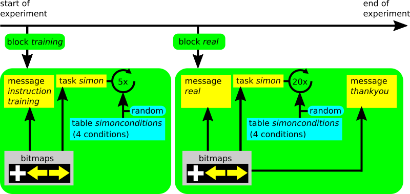

# Un projet complet de recherche en ligne [](https://www.psytoolkit.org/lessons/project.html)

Voici la description complète d'un projet de recherche psychologique en ligne avec des tutoriels vidéo. Cette enquête comprend une expérience en ligne. Si la programmation d'une expérience en ligne ne vous intéresse pas, et si vous souhaitez seulement faire un questionnaire, vous pouvez consulter [la leçon à ce sujet](#questionnaire-project)*. Cette leçon vise en fait à comprendre les expériences psychologiques cognitives et la manière de les intégrer dans les études en ligne. Elle peut être utile à tout chercheur, y compris aux étudiants en psychologie qui réalisent leur projet de recherche.

Cette leçon vous apprendra à utiliser le Psytoolkit pour faire ce qui suit :

* Programmer une expérience à l'aide PsyToolkit
* Tester l'expérience
* Analyser les données des tests
* Intégrer l'expérience dans un questionnaire en ligne
* Obtenir des participants en ligne
* Réaliser l'étude en ligne et collecter les données en ligne
* Analyser les données du groupe avec SPSS ou R

## Étape 1. Réfléchissez à votre expérience et créez des stimuli[](https://www.psytoolkit.org/lessons/project.html#_step_1_think_about_your_experiment_and_create_stimuli){#step_1_think_about_your_experiment_and_create_stimuli}

Avant de commencer à faire quoi que ce soit, il vous faut réfléchir à votre tâche et d'utiliser du papier et un crayon pour dessiner ce à quoi vous voulez que tout cela ressemble. Voici les choses auxquelles il faut penser en général.

1. Qu'est-ce que je veux mesurer exactement, et est-ce que cela peut être implémenté dans PsyToolkit (il y a des limitations avec tout type de logiciel)
2. Combien de temps l'étude doit-elle durer ?
3. Combien d'essais
4. À quoi doivent ressembler les stimuli (vous pouvez aussi avoir des sons, mais ils ne sont pas utilisés dans cet exemple de projet)

## Étape 2. Créez les stimuli [](https://www.psytoolkit.org/lessons/project.html#_step_2_create_new_experiment){#step_2_create_new_experiment}

Dans cette expérience, nous allons reproduire l'effet Simon. J'aurai besoin des stimuli suivants :

1. Une flèche pointant vers la gauche
2. Une flèche pointant vers la droite
3. Une croix de fixation
4. Instructions au début de l'expérience
5. Message d'erreur en cas d'erreur
6. Informations pour dire aux gens qu'ils vont s'entraîner (bloc 1)
7. Informations pour dire aux gens qu'ils vont faire une vraie collecte de données (bloc 2)
8. Un message de remerciement lorsqu'elles sont terminées.

Nous savons que la résolution par défaut des expériences est de 800 par 600 pixels, il faut donc faire en sorte que les stimuli soient adaptés à cette résolution.

* Vous devez apprendre à utiliser un peu [Inkscape](https://www.psytoolkit.org/lessons/inkscape.html) (ou tout autre logiciel de dessin capable d'exporter des fichiers image)
* Open Inkscape
* Dessiner les stimuli, exporter les stimuli, enregistrer le fichier inkscape (SVG)

Regardez la vidéo (15 minutes) sur la façon de dessiner les stimuli (plein écran recommandé). C'est de loin la vidéo la plus longue ici, mais elle vous permet vraiment de vous lancer dans l'une des parties les plus importantes de la conception d'une expérience, à savoir la création de bons stimuli ! 
Le son est un peu faible sur les premières vidéos, il faut donc augmenter le volume !

<iframe width="550" height="360" src="https://www.youtube.com/embed/21z8qVrg1Bc" frameborder="0" allow="accelerometer; autoplay; clipboard-write; encrypted-media; gyroscope; picture-in-picture" allowfullscreen></iframe>

Dans la vidéo, les stimuli sont enregistrés au format PNG. Mais PsyToolkit peut fonctionner avec n'importe quel type de bitmap, comme JPEG, BMP, GIF, etc. Le PNG est choisi ici parce que c'est ce qu'Inkscape exporte. Consultez la [documentation pour plus de détails](#s4-2).

## Étape 3. Créer une nouvelle expérience [](https://www.psytoolkit.org/lessons/project.html#_step_3_create_new_experiment){#step_3_create_new_experiment}

* Connectez-vous et créez une nouvelle expérience
* Appelez-la "simon".
* Commencez à coder dans la case blanche du haut
* Utilisez l'onglet "scripting" pour vous aider

Regardez la vidéo (2 minutes)  pour voir comment créer une nouvelle expérience et démarrer le code :

<iframe width="550" height="360" src="https://www.youtube.com/embed/790jjGFrZJE" frameborder="0" allow="accelerometer; autoplay; clipboard-write; encrypted-media; gyroscope; picture-in-picture" allowfullscreen></iframe>

## Étape 4. Coder l'expérience [](https://www.psytoolkit.org/lessons/project.html#_step_4_create_new_experiment){#step_4_create_new_experiment}

Avant de commencer ici, il est important de comprendre la structure d'une expérience codée dans le langage de script PsyToolkit. Ceci est expliqué dans la [documentation en ligne](#structure_of_scripts). En voici un bref résumé :

* Une expérience est décrite entièrement sous forme de texte.
* Vous devez saisir le texte manuellement dans la zone de texte de votre navigateur
* Une expérience comporte différentes sections (séparées par des lignes vides), et ce sont celles qui sont utilisées ici :
** *bitmaps* pour indiquer à l'ordinateur quelles images sont utilisées pour les stimuli visuels
** *task* consistant à indiquer à l'ordinateur la séquence des événements, le moment, les réponses, etc. dans la tâche Simon
** *table* pour décrire les quatre conditions différentes utilisées dans la section des tâches
** *block* pour décrire un bloc d'essais et présenter les principaux messages, tels que l'instruction et le message de remerciement

La description de ces sections n'est pas exactement l'ordre des événements de l'expérience. L'expérience commence réellement avec le premier bloc, même si celui-ci est placé à mi-chemin dans le code. L'algorithme du script et son déroulement est présenté dans le diagramme ci-dessous :



Le code de l'expérience se trouve ci-dessous, juste à titre de référence. Chaque ligne de code est décrite plus en détail dans les vidéos ci-dessous. Mais il est bon d'y jeter un coup d'œil rapide pour que vous sachiez de quoi il s'agit.

````
bitmaps
  leftarrow
  rightarrow
  training
  real
  instruction
  thankyou
  errorfeedback
  fixpoint

table simonconditions
  "leftpos leftA com"   leftarrow  -200 1
  "rightpos rightA com" rightarrow  200 2
  "leftpos rightA inc"  rightarrow -200 2
  "rightpos leftA inc"  leftarrow   200 1

task simon
  table simonconditions
  keys a l
  show bitmap fixpoint
  delay 200
  clear 1
  show bitmap @2 @3 0
  readkey @4 2000
  clear 2
  if STATUS != CORRECT
    show bitmap errorfeedback
    delay 500
    clear -1
  fi
  delay 500
  save @1 STATUS RT BLOCKNAME

block training
  message instruction
  message training
  tasklist
    simon 5
  end

block real
  message real
  tasklist
    simon 20
  end
  message thankyou
````

### Définition et mise en ligne des stimuli [](https://www.psytoolkit.org/lessons/project.html#_stimuli_definition_and_upload){#stimuli_definition_and_upload}

* d'abord informer l'ordinateur des stimuli et les télécharger
* Afin de dessiner des stimuli à l'écran, vous devez fournir une coordonnée X et une coordonnée Y. Les coordonnées XY 0 0 se rapportent au centre de l'écran. Les coordonnées XY -200 0 se réfèrent à une position à mi-chemin à gauche du centre de l'écran, etc.

Regardez la vidéo (3 minutes) comment donner ces instructions à l'ordinateur

<iframe width="550" height="360" src="https://www.youtube.com/embed/9aD7JAfdsOU" frameborder="0" allow="accelerometer; autoplay; clipboard-write; encrypted-media; gyroscope; picture-in-picture" allowfullscreen></iframe>

### Définir les conditions [](https://www.psytoolkit.org/lessons/project.html#_defining_conditions){#defining_conditions}

créer un tableau PsyToolkit qui contient des informations sur les 4 conditions :

1. Stimulus présenté à gauche + Flèche pointant vers la gauche = compatible
2. Stimulus présenté à droite + flèche pointant vers la droite = compatible
3. Stimulus présenté à gauche + flèche pointant vers la droite = incompatible
4. Stimulus présenté à droite + flèche pointant vers la gauche = incompatible

Regardez la vidéo (5 minutes) sur la façon de programmer les 4 conditions.

<iframe width="550" height="360" src="https://www.youtube.com/embed/2q0oINBNLos" frameborder="0" allow="accelerometer; autoplay; clipboard-write; encrypted-media; gyroscope; picture-in-picture" allowfullscreen></iframe>

### Décrire les événements [](https://www.psytoolkit.org/lessons/project.html#_describing_events){#describing_events}

Chaque événement d'un procès est décrit dans la section des tâches

Regardez la vidéo (7 minutes) sur la manière de décrire la tâche avec les événements d'un essai.

<iframe width="550" height="360" src="https://www.youtube.com/embed/ev2vrMN0j5o" frameborder="0" allow="accelerometer; autoplay; clipboard-write; encrypted-media; gyroscope; picture-in-picture" allowfullscreen></iframe>

### Blocs [](https://www.psytoolkit.org/lessons/project.html#_blocks){#blocks2}

Nous allons maintenant entrer les informations des blocs

* Message de bienvenue
* Bloc d'entrainement de 5 essais
* Bloc de données réel de 20 essais
* Message de remerciement

Regardez la vidéo (4 minutes) sur la façon de mettre en place des blocs d'essais et des messages généraux de bienvenue/instructions/remerciements.

<iframe width="550" height="360" src="https://www.youtube.com/embed/p8qvFqYyJwI" frameborder="0" allow="accelerometer; autoplay; clipboard-write; encrypted-media; gyroscope; picture-in-picture" allowfullscreen></iframe>

## Étape 5. Compiler et exécuter [](https://www.psytoolkit.org/lessons/project.html#_step_5_compile_and_run){#step_5_compile_and_run}

Maintenant que votre code est tapé et que vos stimuli sont téléchargés, essayez de compiler. Le compilateur a probablement dit qu'il y avait une erreur, simplement parce qu'il est très facile de faire une quelque part. Ne vous inquiétez pas, l'ordinateur vous aidera à trouver où l'erreur s'est produite.

Regardez la vidéo (5 minutes) qui explique comment compiler et exécuter votre expérience dans votre navigateur, et comment enregistrer les données automatiquement.

<iframe width="550" height="360" src="https://www.youtube.com/embed/FQ5w2-805as" frameborder="0" allow="accelerometer; autoplay; clipboard-write; encrypted-media; gyroscope; picture-in-picture" allowfullscreen></iframe>

Le codage est souvent un processus d'essais et d'erreurs. Le retour d'information sur les erreurs dans l'encadré jaune devrait vous donner un indice sur ce qu'il faut améliorer. Pouvez-vous déterminer ce que vous avez fait de mal ?

Une fois que la compilation ne renvoie pas de messages d'erreur, vous pouvez tester votre expérience en cliquant sur le bouton "Exécuter".

À la fin de l'expérience, l'ordinateur peut vous montrer vos données et même les enregistrer dans votre compte. Assurez-vous de bien choisir cette option, car nous avons besoin des données pour l'étape suivante.

## Étape 6. Analysez votre dossier de test [](https://www.psytoolkit.org/lessons/project.html#_step_6_analyze_your_test_file){#step_6_analyze_your_test_file}

* Dans l'expérience, naviguez vers le bas jusque "analyze", et sélectionnez le
* Vous pouvez sélectionner le fichier de données que vous venez de créer. C'est maintenant le fichier sur lequel vous travaillez (vous pouvez avoir plusieurs fichiers)
* Dans les cases, vous pouvez saisir les éléments les plus importants pour l'analyse des données.
* Chaque ligne de votre fichier de données est un essai dans la tâche.
* Sélectionnez la colonne qui correspond au RT, à l'erreur, au bloc
* Sélectionnez également que vous souhaitez exclure les données relatives à la formation de votre analyse de données
* Sélectionnez également que vous souhaitez exclure les procès immédiatement après une erreur
* Cliquez sur "analyser" et regardez vos réponses moyennes.

En principe, si vous menez une expérience en laboratoire, vous pouvez simplement effectuer votre expérience et enregistrer les fichiers de données recueillis ici. Si vous le faites, assurez-vous de tenir un journal de bord de votre étude.

En psychologie cognitive, nous recueillons généralement des données auprès d'un certain nombre de participants. Par exemple, dans la tâche de Simon, vous pouvez vous contenter de 10 à 20 participants. Ensuite, dans l'analyse de groupe, nous comparons les scores moyens de chaque participant dans une analyse de groupe, qui sera expliquée plus loin.

Regardez la vidéo (5 minutes) sur la façon d'analyser votre fichier de données de test.

<iframe width="550" height="360" src="https://www.youtube.com/embed/nqHJA_JLty8" frameborder="0" allow="accelerometer; autoplay; clipboard-write; encrypted-media; gyroscope; picture-in-picture" allowfullscreen></iframe>

À ce stade, vous avez appris à coder une expérience et à faire une analyse de base. Dans la suite de la description de ce projet, nous allons intégrer l'expérience *Simon* dans un questionnaire/enquête en ligne et collecter des données en ligne. Ensuite, nous téléchargerons et analyserons les données.

## Étape 7. Mise en place du projet en ligne [](https://www.psytoolkit.org/lessons/project.html#_step_7_setup_online_project){#step_7_setup_online_project}

### Mettre en place une enquête en ligne [](https://www.psytoolkit.org/lessons/project.html#_setup_an_online_survey)

* Maintenant que votre expérience fonctionne, vous êtes prêt à mettre en place une étude en ligne dans laquelle vous intégrerez l'expérience.
* Regardez les fonctions sur la gauche, et sélectionnez "Créer une étude".
* Appelez-le "simon_survey".

Regardez la vidéo (3 minutes) sur la façon de mettre en place les premières parties d'une étude en ligne.

<iframe width="550" height="360" src="https://www.youtube.com/embed/-hzgHWV3CJg" frameborder="0" allow="accelerometer; autoplay; clipboard-write; encrypted-media; gyroscope; picture-in-picture" allowfullscreen></iframe>

### Commencez par des questions et une enquête test [](https://www.psytoolkit.org/lessons/project.html#_start_with_questions_and_test_survey)

* Dans la case du haut se trouve le code de l'enquête.
* Chaque question se compose de quelques lignes et il y a beaucoup de documentation
* Pensez aux choses que vous voulez savoir de vos participants
* Au minimum, vous voulez connaître l'âge
* Vous devez également configurer l'écran d'introduction/de bienvenue
* Vous devez rendre l'étude "en ligne".
* Vous devez compiler et tester l'enquête

 Le bouton *save* de la page de codage d'enquête devient jaune lorsque le code n'a pas été enregistré. <span style="color: red;">Enregistrez souvent si vous ne voulez pas perdre votre code !</span>

Regardez la vidéo (5 minutes) sur la façon de commencer à saisir les questions du questionnaire en ligne dans lequel l'expérience sera intégrée.

<iframe width="550" height="360" src="https://www.youtube.com/embed/CV3hBmMmcSQ" frameborder="0" allow="accelerometer; autoplay; clipboard-write; encrypted-media; gyroscope; picture-in-picture" allowfullscreen></iframe>

### Terminer l'enquête [](https://www.psytoolkit.org/lessons/project.html#_finish_survey)

* Nous ajoutons quelques questions provenant de la bibliothèque des enquêtes
* Intégrer l'expérience
* Compilation et test
* Passer à un mode de collecte de données réel
* Prêts à demander à vos participants !

Regardez la vidéo (5 minutes) pour voir comment l'expérience est intégrée dans le questionnaire en ligne.

<iframe width="550" height="360" src="https://www.youtube.com/embed/64MQM5RNp4I" frameborder="0" allow="accelerometer; autoplay; clipboard-write; encrypted-media; gyroscope; picture-in-picture" allowfullscreen></iframe>

Comme le code de l'expérience, vous pouvez voir le code réel de l'enquête, juste pour vous guider. Chaque ligne de code est décrite plus en détail dans les vidéos.

````
l: age
t: textline
q: How old are you?
- {min=18,max=100} Enter your age

scale: side
- {score=-100} Always left
- {score=-50} Usually left
- {score=0} Both equally
- {score=50} Usually right
- {score=100} Always right

l: questions
t: scale side
o: width 20%
q: Please indicate your preferences in the use of hands in the following activities or objects
- Writing
- Throwing
- Toothbrush
- Spoon

l: score
t: set
- mean $questions

l: simonexperiment
t: experiment
- simon
````

## Étape 8. Analyser les données [](https://www.psytoolkit.org/lessons/project.html#_step_8_analyze_data){#step_8_analyze_data}

Une fois la collecte des données terminée, vous voulez analyser vos données.

### Assurez-vous que l'analyse de votre expérience est paramétrée [](https://www.psytoolkit.org/lessons/project.html#_make_sure_your_experiment_analysis_is_set)

Le système doit savoir quel bloc de données vous voulez inclure (par exemple, vous n'êtes probablement pas intéressé par le bloc de formation), etc.

Regardez la vidéo (1,5 minute) sur la façon de vous préparer à l'analyse des données de tous les participants à votre étude.

<iframe width="550" height="360" src="https://www.youtube.com/embed/WpOmfCeQjXE" frameborder="0" allow="accelerometer; autoplay; clipboard-write; encrypted-media; gyroscope; picture-in-picture" allowfullscreen></iframe>

### Téléchargez vos données [](https://www.psytoolkit.org/lessons/project.html#_download_your_data)

Une fois que vos participants ont fait l'expérience, vous êtes prêt à récupérer vos données sur le serveur.

* Regardez la vidéo (3 minutes) pour voir comment télécharger les données, et quels sont les fichiers dans les fichiers data.zip
* Il est possible d'inclure des fichiers de données dans un format compatible avec SPSS, ce qui permet d'introduire très facilement vos données dans SPSS^[D'autres formats de données sont possible,notamment csv qui permet d'importer les données dans presque tous les logiciels de statistiques : R, Jmaovi, jmp.]
* Regardez la vidéo (3 minutes) sur la compréhension du processus de téléchargement et la signification des différents fichiers dans le téléchargement.

<iframe width="550" height="360" src="https://www.youtube.com/embed/itmFGBYiQ_Q" frameborder="0" allow="accelerometer; autoplay; clipboard-write; encrypted-media; gyroscope; picture-in-picture" allowfullscreen></iframe>

### Ouvrez votre fichier de données dans SPSS [](https://www.psytoolkit.org/lessons/project.html#_open_your_data_file_in_spss)

Dans cette section, nous allons analyser les données avec SPSS. Il est supposé que vous avez installé SPSS, qui est populaire dans l'enseignement de la psychologie. Bien sûr, les données sont dans un format générique et peuvent être analysées avec n'importe quel programme de statistiques. La procédure d'importation des données est analogue.

Regardez la vidéo (8 minutes) sur la façon d'importer et d'analyser votre ensemble de données PsyToolkit dans SPSS.

<iframe width="550" height="360" src="https://www.youtube.com/embed/2F05SZTcpbA" frameborder="0" allow="accelerometer; autoplay; clipboard-write; encrypted-media; gyroscope; picture-in-picture" allowfullscreen></iframe>

### Et c'est tout 
Nous espérons que cela vous aidera à mettre en place votre propre étude. Si vous avez encore des questions, n'hésitez pas à m'en faire part [par e-mail](mailto:psytoolkit@gmx.com).


