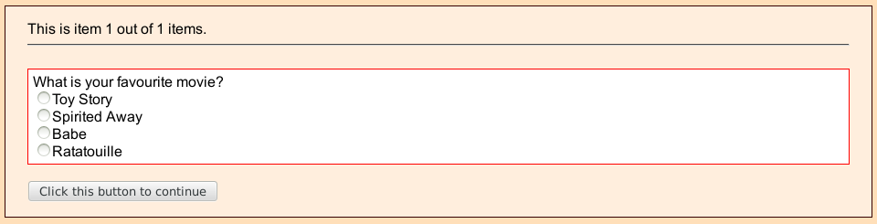
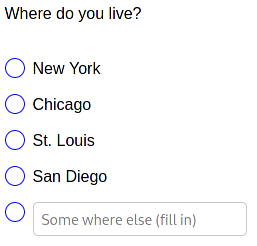
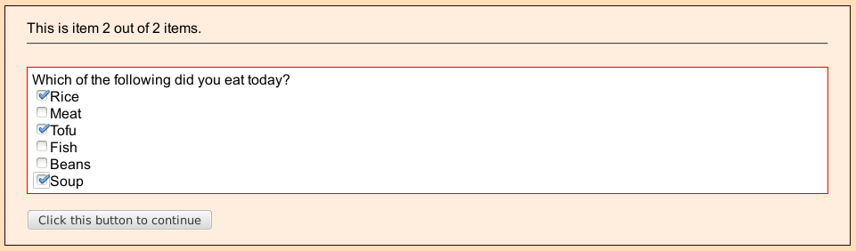
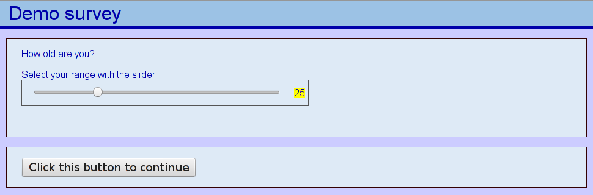
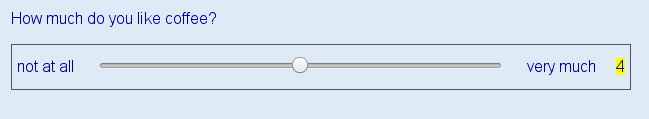
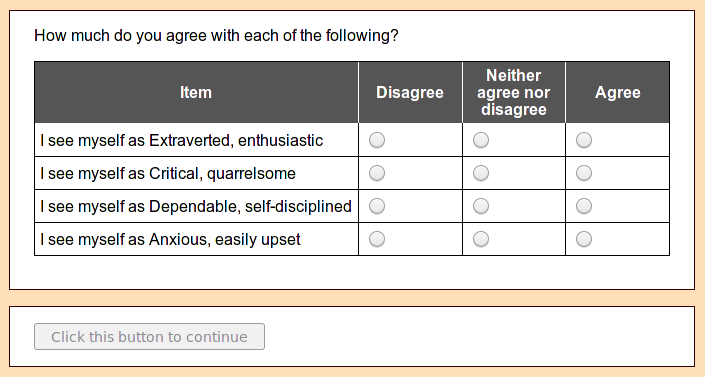
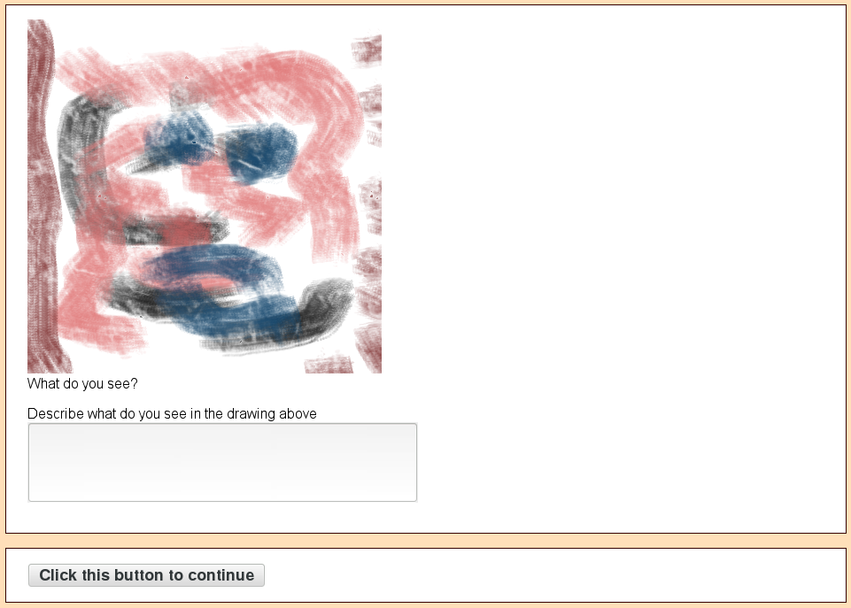

# Les questionnaire en ligne{#s8}
Pour utiliser les questionnaires en ligne, voir [l'introduction aux questionnaires en ligne](#s7). 
Le langage de script d'enquête est complètement différent du langage de script d'expérience. Si vous souhaitez intégrer une expérience dans une enquête en ligne, vous devez suivre [ces instructions](https://www.psytoolkit.org/doc3.2.0/online-survey-syntax.html#experiment).

## Structure d'un questionnaire [](https://www.psytoolkit.org/doc3.4.0/online-survey-syntax.html#_structure_of_questionnaire){#s8-1}

Les questionnaires sont de simples fichiers texte. Chaque ligne a une signification. L'ordinateur lit le questionnaire ligne par ligne. Le premier caractère de chaque ligne a généralement une signification particulière.

* Chaque questionnaire se compose de plusieurs questions, codées sous forme de texte simple (que vous pouvez éditer dans votre navigateur)
* Le questionnaire doit être saisi manuellement, ligne par ligne (exemples ci-dessous)
* Chaque question se compose de quelques lignes
* Les questions sont séparées les unes des autres par une (ou plusieurs) ligne vide
* Chaque question, quel qu'en soit le type, a une structure de base simple ([pour en savoir plus sur la structure des questions](#s8-1-1))
* Chaque questionnaire peut avoir des sections qui randomisent l'ordre ([en savoir plus sur l'ordre randomisé](#randomization))
* Chaque questionnaire peut comporter des [commentaires](#) sur les lignes commençant par le signe hashtag (#comment)

### Structure générale d'une question [](https://www.psytoolkit.org/doc3.4.0/online-survey-syntax.html#questionstructure){#s8-1-1}
* Chaque question est composée d'un certain nombre de lignes de texte.
* Les questions sont séparées les unes des autres par une ligne vide
* Chaque ligne commence (généralement) par une lettre suivie d'un deux-points. La lettre décrit une caractéristique importante, comme le nom de la question ou le type de question.
* Chaque question comporte un ou plusieurs éléments, chacun commençant par un signe moins

* La première ligne d'une question commence par **l:**. La lettre *l* signifie "étiquette (label)". Chaque question a une étiquette, ou un "nom". Et ce, pour deux raisons : 1) L'ordinateur a besoin d'un moyen d'identifier une question, et il utilise le label. 2) L'utilisateur a besoin d'un moyen d'identifier les réponses aux questions, et label est le moyen le plus simple pour y parvenir.
* Un label ne peut comporter que des lettres (majuscules ou minuscules) et des chiffres, ainsi que le caractère de soulignement (underscore).
* Chaque question doit commencer par l:, mais il n'est pas nécessaire de donner une étiquette. Dans ce cas, le logiciel appellera la question "auto__" suivie d'un chiffre. C'est pratique si vous n'êtes pas disposé à étiqueter vos questions. Vous pouvez toujours les identifier par l'ensemble de la question. Et pour les sauts de question, le label n'est généralement pas nécessaire pour les utilisateurs.

**Exemple de structure de la question. La flèche <-- sert uniquement pour introduire une explication**
````
l: MyQuestion1                   <-- this is the label
t: radio                         <-- this is the type of question
q: What is your favourite movie? <-- this is text of the question the participant sees
- Toy Story                      <-- answer 1
- Spirited Away                  <-- answer 2
- Babe                           <-- answer 3
- Ratatouille                    <-- answer 4
                                 <-- the empty line separating this question from the next
````
* Chaque question peut faire apparaître une image en haut. Vous devez télécharger le fichier image (png, bmp, gif, jpg, etc.). Voir les images.
* Vous pouvez utiliser la ligne d'option **o: random** pour rendre aléatoire l'ordre des options de réponses.

### Commentaires pour les programmateurs{#comment} [](https://www.psytoolkit.org/doc3.4.0/online-survey-syntax.html#questionstructure){#s8-1-2}
Lorsque vous programmez votre enquête, vous pouvez parfois vouloir faire un commentaire qui vous est destiné et que l'ordinateur doit ignorer. Vous pouvez utiliser le hashtag pour cela.

Contrairement aux scripts d'expérimentation du PsyToolkit, le symbole de commentaire "#" doit se trouver au début d'une ligne. En d'autres termes, vous ne pouvez pas avoir de commentaires commençant au milieu d'une ligne.

## Formatage du texte [](https://www.psytoolkit.org/doc3.4.0/online-survey-syntax.html#Comments){#s8-1-2}
Vous pouvez formater le texte en utilisant les balises HTML standard. Les plus courantes sont celles pour le gras, l'italique et la couleur du texte. La couleur générale de l'écran ne peut pas être modifiée.

* Tout ce qui se trouve entre \<b> et \</b> sera présenté en caractères gras.
* Tout ce qui se trouve entre \<i> et \</i> sera présenté en italique.
* Tout ce qui se trouve entre \<font color='red'> et \</font> sera présenté en rouge, etc.

**Exemple de formatage du texte**
````
l: MyQuestion
t: radio
q: What is your <i>favourite</i> movie?
- <b>Toy Story</b>
- <font color='blue'>Spirited</font> Away
- Babe
- Ratatouille
````

## Types de questions [](https://www.psytoolkit.org/doc3.4.0/online-survey-syntax.html#questiontypes){#type_questions}
Il y a les types de questions suivants :

* [radio](#survey_radio) Un choix parmi de nombreuses options
* [drop](#survey_drop) sélectionner la réponse dans un menu
* [check](#survey_check) les choix multiples parmi les nombreuses options (cases à cocher)
* [rank](#survey_rank) Ordonner des propositions
* [experiment](#survey_experiment) Intégrer une expérience
* [scale](#survey_scale) Utiliser des échelles de type Likert
* [range](#survey_range) Permet à l'utilisateur de saisir une plage de nombres entre deux valeurs
* [textline](#survey_textline) Le participant peut saisir seulement une ligne de texte
* [textbox](#surveytextbox) Le participant peut saisir plusieurs lignes de texte
* [multiradio](#survey_multiradio) Plusieurs éléments à choix unique dans une question

Il existe les types suivants qui ne présentent que des informations et un bouton "Continuer

* [info](#info) Montrez juste quelques informations, un message, etc.
* [youtube](#survey_youtube) Jouer une vidéo youtube dans une question

Il existe différents type de contrôle :

* [jump](#survey_jump) saut vers un label de question (conditionnel ou inconditionnel)
* [set](#survey_scoring) Fixer une étiquette de question (pour la notation et les nombres aléatoires)
* [random](#survey_randomization) aléatoriser des questions ou [contrebalancer](#survey_randomjump) les versions d'un questionnaire

Vous pouvez insérer dans une question du son ou une vidéo : 

* [Play a sound](#survey_playasound) Présenter un son dans une question
* [Play a video](#survey_playavideo) Présenter une vidéo dans une question

### Radio: Sélectionner un parmi plusieurs [](https://www.psytoolkit.org/doc3.4.0/online-survey-syntax.html#radio){#survey_radio}
Utilisez cette option lorsque vous souhaitez qu'une seule réponse possible soit sélectionnée. Le nom "radio" vient des radios classiques, qui avaient un ensemble de boutons dont au maximum un pouvait être enfoncé.

**Exemple**
````
l: MyQuestion1
t: radio
q: What is your favourite movie?
- Toy Story
- Spirited Away
- Babe
- Ratatouille
````


Le paramètre "q :" est le seule  qui peut s'étendre sur plusieurs lignes. Cela peut parfois être pratique pour poser des questions plus longues, comme dans l'exemple ci-dessous, qui utilise le format HTML.

**Exemple de question sur plusieurs lignes**
````
l: MyQuestion1
t: radio
q: In the following question, we would like to which movie you like
best. Make sure you understand the following:
<ul>
<li>This is only about movies
<li>You are allowed to say that you are not sure.
</ul>
- Toy Story
- Spirited Away
- Babe
- Ratatouille
- I am not sure
````
******
Au lieu d'un texte, vous pouvez afficher une image. Vous devez télécharger les images (comme pour topimage) et ensuite utiliser l'option {image=nom de fichier}. Dans les fichiers d'affichage, vous pouvez voir les noms de fichiers que vous avez déjà. N'utilisez pas les fichiers comportant des espaces. Vous devez saisir le nom de fichier complet, y compris l'extension, comme jpg, png, bmp ou gif. Cela vous permet même de télécharger de petites animations en utilisant des gifs animés.

********

**Exemple avec des images de type radio téléchargées**
````
l: MyQuestion1
t: radio
q: In the following question, we would like to which movie you like
best. Make sure you understand the following:
<ul>
<li>This is only about movies
<li>You are allowed to say that you are not sure.
</ul>
- {image=toystory.jpg}
- {image=spirited.jpg}
- {image=babe.png}
- {image=ratatouille.bmp}
- I am not sure
````
Les notes par défaut d'une question radio avec trois options de réponse sont 1, 2 et 3. Vous pouvez modifier ces scores en utilisant la méthode ci-dessous en utilisant l'option {score=?}, où ? doit être un nombre.

**Example de changement de score**
````
l: weather
t: radio
q: What is the weather like?
- {score=3} Very bad
- {score=2} It could be better
- {score=1} Very Sunny
````
Parfois, vous pouvez demander aux gens d'entrer leur propre option de réponse, vous pouvez le faire comme suit :

**Exemple avec "autre réponse"**
````
l: my_question
t: radio
q: Where do you live?
- New York
- Chicago
- St. Louis
- San Diego
- {other} Some where else (fill in)
````
Voici à quoi cela devrait ressembler



Parmi les questions fréquemment posées, il y a comment ajouter une option "autre" en utilisant une question séparée. [cliquez ici pour consulter la réponse](https://www.psytoolkit.org/doc3.4.0/online-survey-syntax.html#other).

Vous pouvez permettre aux gens de passer complètement la question radio en utilisant l'option "free". C'est-à-dire que les gens sont libres de passer la question. Pour ce faire, procédez comme suit :

````
l: example
t: radio
o: free
q: What food do you like?
- Potatoes
- Rice
- Bread
````

### drop : sélectionner les réponses dans un menu [](https://www.psytoolkit.org/doc3.4.0/online-survey-syntax.html#drop){#survey_drop}

Une question de  type *drop* est analogue au type radio, sauf que les réponses se trouvent dans un menu déroulant cliquable. Cette option est utile pour les listes plus longues ou si vous souhaitez gagner de la place à l'écran. En outre, il n'y a pas d'option *other* comme dans le cas de la radio.

**Exemple d'option libre**

````
l: days
t: drop
q: What day of the week would like to play chess?
- Monday
- Tuesday
- Wednesday
- Thursday
- Friday
- Saturday
- Sunday
````

### check : sélectionner un ou plus parmi plusieurs [](https://www.psytoolkit.org/doc3.4.0/online-survey-syntax.html#check){#survey_check}

**Exemple**
````
l: MyQuestion2
t: check
q: Which of the following did you eat today?
- Rice
- Meat
- Tofu
- Fish
- Beans
- Soup
````
Vous pouvez aléatoriser l'ordre des éléments dans une question check en définissant les options **o: random** (voir le deuxième exemple). Vous pouvez demander aux participants de sélectionner au moins une, ou au moins deux, ou au moins n des options, voir l'exemple ci-dessous. Ce n'est que lorsque les participants sélectionnent au moins deux éléments que le bouton "Continuer" devient cliquable.

**Exemple**
````
l: MyQuestion2
t: check
o: require 2
q: Which of the following food do you like? Select at least 2 items.
- Rice
- Meat
- Tofu
- Fish
- Beans
- Soup
````
Vous pouvez même fixer le nombre maximum d'options qu'un participant peut choisir en ajoutant un deuxième chiffre à l'option **o: require**. Le deuxième chiffre indique le nombre maximum d'éléments qui peuvent être sélectionnés. Par exemple, si vous voulez que les personnes sélectionnent au moins 2 mais pas plus de 3 éléments, vous pouvez le faire comme suit :

**Exemple**
````
l: MyQuestion2
t: check
o: require 2 3
q: Which of the following food do you like? Select at least 2 items, but no more than 3 items.
- Rice
- Meat
- Tofu
- Fish
- Beans
- Soup
````


Vous pouvez demander une ou plusieurs autres options, et vous pouvez définir la taille de la zone de texte avec l'option *lenght* (ou *size*).

**Exemple**
````
l: MyQuestion2
t: check
o: require 2 3
q: Which of the following food do you like? Select at least 2 items, but no more than 3 items.
- Rice
- Meat
- {other,length=30} Fill in something else
````

### rank: Classer ou ordonner les articles [](https://www.psytoolkit.org/doc3.4.0/online-survey-syntax.html#rank){#survey_rank}

**Exemple**
````
l: my_question
t: rank
q: Order of the following foods, starting with the one you like most.
- Rice
- Meat
- Tofu
- Fish
- Beans
- Soup
````
Vous pouvez aléatoriser l'ordre de départ des éléments d'une question de classement en définissant les options *o: random* (voir le deuxième exemple).

**Exemple**
````
l: my_question
t: rank
o: random
q: Order of the following foods, starting with the one you like most.
- Rice
- Meat
- Tofu
- Fish
- Beans
- Soup
````
L'option *o: numbers* indiquent un classement numéroté

**Exemple avec des numéros devant les items**
````
l: my_question
t: rank
o: numbers
q: Order of the following foods, starting with the one you like most.
- Rice
- Meat
- Tofu
- Fish
- Beans
- Soup
````

### Option non listée pour les question de type radio et check [](https://www.psytoolkit.org/doc3.4.0/online-survey-syntax.html#others){#survey_others}

Une question fréquente est de savoir s'il est possible d'avoir une "autre" option et une ligne où les gens peuvent donner une alternative. Cela est possible pour les questions radiophoniques sur un écran, mais vous pouvez aussi facilement le configurer comme suit :

**Exemple**
````
l: MyQuestion
t: radio
q: What is your favourite movie?
- Toy Story
- Spirited Away
- Babe
- Ratatouille
- Another movie not listed here

l:
t: jump
- if $MyQuestion != 5 then goto MyNextQuestion

l: OtherFavouriteMovie
t: textline
q: Type the name of your favourite movie
- My most favourite movie is

l: MyNextQuestion
t: radio
q: Did you do sports yesterday?
- Yes
- No
````

Dans l'exemple ci-dessus, la ligne "if \$MyQuestion != 5 then goto MyNextQuestion" peut être expliquée comme suit :

\$MyQuestion (le \$ indique qu'il s'agit d'une variable) fait référence au numéro de ligne de l'option sélectionnée. Ainsi, si quelqu'un sélectionne "Toy Story", il obtient la valeur 1, et un autre choix non répertorié ici obtient la valeur 5 (la cinquième ligne).

Le != signifie en langage informatique n'est pas égal. Ainsi, si la ligne sélectionnée n'est pas égale à la valeur 5, alors les gens n'ont pas besoin d'entrer quoi que ce soit dans le texte. Ils sont prêts à continuer. Mais s'ils ont sélectionné la cinquième ligne, ils passeront à la question suivante où ils pourront entrer une valeur.

### info : Montrer une information, un message etc.[](https://www.psytoolkit.org/doc3.4.0/online-survey-syntax.html#info){#survey_info}

Parfois, vous voulez juste que les gens lisent quelque chose ou donnent leur avis sans poser de questions. Pour cela, vous pouvez utiliser le type info. Comme pour les autres types, vous pouvez présenter une image au-dessus. Elle ne comporte (actuellement) aucune ligne commençant par "-". Vous pouvez utiliser le HTML pour formater le texte et vous pouvez insérer des variables comme dans les autres types de questions.

**Exemple 1**
````
l: some_message
t: info
q: Hello<br>
Here is some information without questions to answer.
````

**Exemple 2**
````
l: some_message
i: some_image.png
t: info
q: Thank you. Here is some feedback.<br>
Your score was: {$score}
````
Vous pouvez utiliser l'option *end* pour afficher l'information sans bouton continuer. Cette option peut être utile si vous souhaitez ne terminer l'enquête que sous certaines conditions, par exemple sous forme d'exclusion.

**Exemple**
````
l: some_message
t: info
o: end
q: Sorry, the survey ends here.
Please <a href='http://www.google.com'>click this link to leave</a>, or close the window.
````

### Play a sound [](https://www.psytoolkit.org/doc3.4.0/online-survey-syntax.html#sound){#survey_playasound}

Pour chaque type de question, vous pouvez ajouter un (ou plusieurs) fichier(s) sonore(s). Vous trouverez ci-dessous deux exemples :

**Exemple**
````
l: q1
a: horse.mp3
t: info
q: Play the sound. Which animal do you hear?
- Horse
- Pig
- Cow
````
Les fichiers MP3 sont beaucoup plus petits que les fichiers WAV, il vaut donc mieux utiliser le MP3, bien que vous puissiez utiliser n'importe quel type de fichier sonore. Les fichiers sonores occupent une grande partie de la "bande passante". Si possible, mettez les fichiers sonores sur un site web externe et faites-y référence en utilisant le préfixe http :, comme dans l'exemple ci-dessous.

**Exemple 2**
````
l: q1
a: http://www.my_webpage.com/sounds/horse.wav
t: info
q: Play the sound. Which animal do you hear?
- Horse
- Pig
- Cow
````
Vous pouvez utiliser l'option **o: no_sound_replay** pour vous assurer qu'un son ne peut être écouté qu'une seule fois (exemple ci-dessous)

**Exemple 3**
````
l: q1
a: horse.mp3
o: no_sound_replay
t: info
q: Play the sound. Which animal do you hear?
- Horse
- Pig
- Cow
````

### Play a video [](https://www.psytoolkit.org/doc3.4.0/online-survey-syntax.html#video){#survey_playavideo}

Pour chaque type de question, vous pouvez ajouter une (ou plusieurs) vidéo(s). Vous trouverez ci-dessous deux exemples. **Vous ne pouvez pas télécharger de fichiers vidéo sur le serveur PsyToolkit**. Vous devez les placer sur votre propre serveur ou, par exemple, sur Google drive.
Dans l'exemple 1, nous jouons simplement une vidéo qui se trouve quelque part sur un serveur :

Notez que vous pouvez également visionner des vidéos sur YouTube, [cliquez ici](#youtube).

**Exemple 1**
````
l: newquestion1
t: radio
v: https://www.w3schools.com/html/mov_bbb.mp4
q: Do you like this video clip?
- Yes
- No
````
Pour les vidéos, vous pouvez spécifier des options spécifiques dans votre question. Deux options sont disponibles :

* Vous pouvez définir la largeur de la vidéo avec l'option **vdei_width**. La largeur doit être donnée en pixels.
* Parfois, les gens veulent que la vidéo ne soit lue qu'une seule fois et qu'elle ne soit pas rejouée. Cela peut être fait avec l'option **no_video_replay**

Dans l'exemple 1, nous passons la même vidéo, mais nous montrons maintenant l'utilisation de deux options spécifiques.

**Exemple 2**
````
l: newquestion1
t: radio
o: video_width 800
o: no_video_replay
v: https://www.w3schools.com/html/mov_bbb.mp4
q: Do you like this video clip?
- Yes
- No
````
Il est possible d'avoir plusieurs vidéos sur un même écran. Il suffit d'avoir les différentes URL sur la ligne v : séparées par un espace. Bien que cela soit possible, il est difficile de voir en quoi cela peut être utile.
Vous pouvez ajouter l'option ligne **o: loop** à votre question, ce qui permettra de lire la même vidéo en boucle.
Vous pouvez vous-même télécharger des fichiers vidéo sur votre Google Drive. Pour les lire, vous devez utiliser quelques astuces :

* Téléchargez votre fichier vidéo sur votre Google Drive.
* Partagez-le sous forme de lien et copiez le lien (il y a un bouton "Copier le lien" sur votre lecteur Google dans la boîte de dialogue de partage)
* Copiez le lien sur votre ligne **v :**.

Pour plus d'informations à ce sujet, consultez la leçon sur [l'audio et la vidéo dans les enquêtes](#s10).

### youtube [](https://www.psytoolkit.org/doc3.4.0/online-survey-syntax.html#youtube){#survey_youtube}

Vous pouvez intégrer une vidéo YouTube. Sur la ligne d'option "-", vous devez entrer le code de la vidéo, que vous pouvez obtenir à partir de l'URL. Il s'agit de la partie qui suit le mot "watch". Ainsi dans la ligne suivante https://www.youtube.com/watch?v=m9WxvT-82Xg, c'est le m9WxvT-82Xg

**Exemple**
````
l: MyQuestion3
t: youtube
q: Please watch the following video
- m9WxvT-82Xg
````

### experiment : Intégrer une expérience de temps de réaction [](https://www.psytoolkit.org/doc3.4.0/online-survey-syntax.html#experiment){#survey_experiment}

Vous pouvez utiliser le nom d'une de vos expériences. Assurez-vous qu'elle fonctionne avant de l'intégrer. Notez que vous pouvez omettre la ligne **q :** pour gagner de la place au-dessus de la zone où l'expérience est présentée.

**Exemple**
````
l: MyQuestion4
t: experiment
q: Please do the following experiment
- myexperiment
````
**Exemple sans q: ce qui préserve de la place à l'écran**
````
l: MyQuestion4
t: experiment
- myexperiment
````
Vous pouvez ajouter l'option {fullscreen} pour demander que l'expérience se déroule en plein écran. Bien entendu, c'est à l'utilisateur final de le faire, et il se peut que l'expérience ne fonctionne pas dans tous les navigateurs (mais elle fonctionne dans Firefox et Chrome).

**Exemple d'expérience en mode plein écran**
````
l: MyQuestion4
t: experiment
- {button_above} myexperiment
````
Les enquêtes et les expériences peuvent "se parler". Il y a toute une leçon à ce sujet. [Cliquez ici pour cette leçon](#s11).

### jump : passer une question (conditionnelement ou non)[](https://www.psytoolkit.org/doc3.4.0/online-survey-syntax.html#jump){#survey_jump}

Avec jump, vous pouvez sauter de question en question dans le questionnaire. Il n'est généralement nécessaire que si vous souhaitez poser certaines questions de manière conditionnelle. Par exemple, si vous avez une question réservée aux femmes, il est pratique de demander d'abord au participant son sexe, puis, en fonction de la réponse, de passer aux questions.

* Les sauts ne doivent pas nécessairement comporter un label (bien qu'ils doivent commencer par **l:**), car les sauts eux-mêmes ne sont pas intéressants pour votre analyse.
* Les questions de saut ne comportant qu'une seule ligne "if-then" peuvent également être placées dans une ligne **j:** (voir l'exemple ci-dessous).

Vous devrez avoir au moins une ligne commençant par un "-". Dans la ligne "-", vous pouvez avoir un "if" construit de la manière suivante. Vous pouvez avoir un "if" (conditionnel) ou juste un "goto" (saut inconditionnel) :

* if <valeur> <comparateur> <valeur> alors goto <étiquette>
* goto <étiquette>

Dans ce qui précède, la valeur peut être un caractère $ avec une étiquette ou un chiffre (voir exemples). Le comparateur peut être l'un des éléments suivants :

| Comparateur | Signification                            |
|-------------|------------------------------------------|
| ==          | Est égale à ? (un seul "=" marche aussi) |
| !=          | N'est pas égal ?                         |
| <           | Est plus petit que ?                     |
| >           | Est plus grand que ?                     |
| <=          | Est plus petit ou égal à ?               |
| >=          | Est plus grand ou égal à ?               |


* Dans une instruction de type jump , vous pouvez avoir plusieurs lignes if-then, et elles sont exécutées l'une après l'autre jusqu'à ce que la condition if s'applique.
* Il est nécessaire que vous ayez des espaces entre les éléments de la partie comparateur (donc écrivez "si \$q1 == 1", et non "si \$q==1"). Si vous n'utilisez pas d'espaces, cela ne fonctionnera pas.
* Le signe "dollar" de l'étiquette est important, il signifie que vous cherchez la valeur de la réponse à cette question. Cependant, après l'instruction "goto", il n'y a pas de signe de dollar.
* Vous pouvez également comparer les réponses à deux questions. Cela ne fonctionne que pour les questions de type radio.
* Vous pouvez également utiliser and (et), or (ou), et des parenthèses pour rendre complexe les règles if-then, voir les exemples ci-dessous.

**Exemple de jump**
````
l: sex
t: radio
q: What is your biological sex
- Male
- Female

l: jump1
t: jump
- if $sex == 1 then goto car

l: birthcontrol
t: radio
q: Do you take birth control pills?
- Yes
- No

l: car
t: radio
q: Do you have a car?
- Yes
- No

l: birthcontrol
t: radio
q: What type of birthcontrol do you use?
- pill
- coil
- condoms
- do not wish to answer this question
````

Parfois, on a juste envie de passer d'un endroit à l'autre du questionnaire. Dans l'exemple suivant, la question "blabla" ne sera jamais posée :

**Exemple de jump inconditionnel**
````
l: somejump
t: jump
- goto myotherquestion

l: blabla
t: radio
q: How are you?
- Just normal
- Fine

l: myotherquestion
t: radio
q: What is the weather like?
- Rain
- Dry and overcast
- Dry and sunny
- Something different.
````
Si tout ce que vous voulez faire est un saut inconditionnel comme dans l'exemple ci-dessus, vous pouvez utiliser la commande **j:** avec juste l'étiquette vers laquelle vous voulez passer :

**Exemple de jump inconditionnel avec une instruction courte j:**
````
j: myotherquestion

l: blabla
t: radio
q: How are you?
- Just normal
- Fine

l: myotherquestion
t: radio
q: What is the weather like?
- Rain
- Dry and overcast
- Dry and sunny
- Something different.
````
Parfois, vous voulez juste terminer une enquête. Pour cela, vous pouvez utiliser l'instruction **end** dans une déclaration **if**. Dans l'exemple ci-dessous, l'enquête n'est pas destinée aux hommes. Si quelqu'un indique être un homme, l'enquête se termine.
Vous pouvez également utiliser **j:** pour les questions sautant d'une seule ligne, comme vous pouvez également le voir dans l'exemple ci-dessous.

**Exemple de jump vers la fin d'un questionnaire**
````
l: sex
t: radio
q: What is your biological sex
- Male
- Female

j: if $sex == 1 then end

l: birthcontrol
t: radio
q: Do you take birth control pills?
- Yes
- No
````
Enfin, dans les questions de type [check](#survey_check), vous pouvez vérifier si un élément spécifique de votre liste a été coché Voici un exemple courant :

**Exemple de jump à partir d'un item de question de type check**
````
l: food
t: check
q: What food did you just eat?
- Bread
- Rice
- Noodles
- No food, I only drank
- Something else

l:
t: jump
- if $food.4 == 0 or $food.5 == 0 then goto drinkquestion

l: otherfood
t: textline
q: Please enter what food you ate
- The name of the food

l: drinkquestion
t: radio
q: What did you just drink?
- Water
- Fruit juice
- Fizzy drink
- Tea
- Coffee
- Alcoholic beverage
````
* La notation avec le point prend la valeur d'un sous-article. La variable \$food.4 peut être 0 (non coché) ou 1 (coché). Ainsi, les sous-items cochés ont toujours pour valeur 0 ou 1.
*  entendu, cela ne fonctionne pas pour les questions de type radio, dans lesquelles vous devez simplement vérifier la valeur de \$food (qu'elle soit de 4 ou non).
* Pour le saut inconditionnel, il suffit également de faire *j:* vers la fin de l'enquête

La possibilité d'utiliser l'instruction **skip** est une nouveauté depuis la version 3.0.0. Souvent, vous voulez juste avoir une question supplémentaire lorsque les gens choisissent une réponse spécifique, dans ce cas vous pouvez la coder comme suit :

**Exemple de jump à partir d'un item de question de type check**
````
l: food
t: check
q: What food did you just eat?
- Bread
- Rice
- Noodles
- No food, I only drank
- Something else

j: if $food.4 == 0 or $food.5 == 0 then skip next

l: otherfood
t: textline
q: Please enter what food you ate
- The name of the food

l: drinkquestion
t: radio
q: What did you just drink?
- Water
- Fruit juice
- Fizzy drink
- Tea
- Coffee
- Alcoholic beverage
````
Notez que vous pouvez également avoir différents exemples d'utilisation de la fonction "skip". Si vous avez juste "passez à la suite", une seule question sera ignorée si la condition est vraie. Vous pouvez aussi écrire, par exemple, **skip 1**, **skip 2**, où le nombre est le nombre de questions que vous voulez sauter.

### textline : saisie d'une ligne de texte [](https://www.psytoolkit.org/doc3.4.0/online-survey-syntax.html#textline){#survey_textline}

Parfois, vous souhaitez qu'un participant saisisse une ligne de texte, pour indiquer par exemple son numéro de participant, son âge, son adresse électronique ou son nom. Vous pouvez utiliser **textline** pour cela.

**Exemple**
````
l: MyQuestion6
t: textline
q: Please enter your first name and surname
- First name
- Surname
````

**Exemple**
````
l: MyQuestion6
t: textline
q: Please enter your first name and surname
- First name
- {require} Surname
````

Vous pouvez forcer la longueur de ligne affichée à avoir un certain nombre de caractères avec l'option {length=X}, où X est un nombre entier :

**Exemple**
````
l: MyQuestion6
t: textline
q: Please enter your first name and surname
- First name
- {require} Surname
````

Vous pouvez forcer les gens à entrer un nombre entre deux valeurs. Pour ce faire, vous devez spécifier min et max, puis le questionnaire forcera l'utilisateur à entrer un nombre.

**Exemple**
````
l: MyQuestion6
t: textline
q: Please enter your first name and surname
- First name
- {length=10} Surname
- {min=10,max=100} Type your age (must be numerical)
````

Vous pouvez forcer les gens à entrer une adresse électronique (facultatif ou non). L'option {email} indique au logiciel de s'assurer que les personnes saisissent une adresse électronique valide.

**Exemple de demande d'un mail valide**
````
l: MyQuestion6
t: textline
q: We need your email address.
- {email} Please enter a valid email address
````
Parfois, vous voulez juste avoir la question principale et pas de texte pour la ligne commençant par "-". Cela peut être fait, voir l'exemple ci-dessous.

**Exemple avec un élément vide**
````
l: MyQuestion6
t: textline
q: Please enter your name
-
````
CONSEIL : L'alignement de la saisie de texte peut parfois être délicat, voici un exemple de la manière dont cela peut être fait (en utilisant des balises HTML). Il est prévu de faciliter cette opération dans les futures versions.

**Exemple d'alignement des champs texte**
````
l: myquestion
t: textline
q: Name
- <pre style="display:inline">First Name :</pre>
- <pre style="display:inline">Middle Name:</pre>
- <pre style="display:inline">Last Name  :</pre>
- <pre style="display:inline">Test       :</pre>
````

Vous pouvez utiliser le numéro saisi plus tard dans l'enquête dans des sauts conditionnels (jump), comme celle-ci :

**Exemple utilisant un nombre pour un saut conditionnel**
````
l: age
t: textline
q: xxx
- {number} How old are you?

j: if $x.1 < 18 then end
````
### textbox : saisie d'une ou plusieurs ligne de texte [](https://www.psytoolkit.org/doc3.2.0/online-survey-syntax.html#textbox){#survey_textbox}

Parfois, vous souhaitez qu'un participant saisisse un texte supplémentaire, par exemple un commentaire sur l'enquête.

**Exemple**
````
l: MyQuestion6
t: textline
q: Please enter your feedback and (optionally) your name and address
- Feedback
- Name and address
````
Alors que **textline** a l'option "lenght", **textbox** a une largeur (width) et une hauteur(height) qui peuvent être paramétrées de différentes façons comme dans l'exemple ci-dessous :

**Exemple**
````
l: MyQuestion6
t: textbox
q: Please enter your feedback
- Your first comment (note: no with or height provided)
- {w=100,h=5} Your second comment (here we have 100 characters width and 5 lines high
- {width=100,height=5} Options spelled out in full works too
````
Comme pour **textline**, une option **require** (obligatoire) peut être utilisée.

### Range : entrer une valeur numérique [](https://www.psytoolkit.org/doc3.2.0/online-survey-syntax.html#range){#survey_range}

Parfois, vous souhaitez entrer une valeur numérique, comme l'âge ou la valeur sur une échelle de Likert. Avec "plage", vous obtenez un curseur, et vous voyez le nombre dans une case jaune éclairée à droite du curseur. Les participants peuvent utiliser la souris ou les touches fléchées pour modifier le nombre.



Vous pouvez spécifier la valeur minimale et maximale avec min et max comme indiqué ci-dessous. Sinon, l'échelle va de 0 à 100.
Certains chercheurs n'aiment pas les curseurs et veulent que les gens puissent simplement entrer un nombre avec le clavier. C'est possible : Vous pouvez utiliser la ligne de texte à la place et demander un nombre. Voir [textline.](#textline)

**Exemple**
````
l: age
t: range
q: What is your age?
- {min=18,max=100}

l: agefamily
t: range
q: How old are you parents if alive
- {min=18,max=120} Father
- {min=18,max=120} Mother

l: odd
t: range
q: Which number is your favorite?
- {min=1,max=100,by=2} Favorit odd number
- {min=2,max=100,by=2} Favorit even number

l: smallnumber
t: range
q: Choose a number between 0 and 1
- {min=0,max=1,by=0.1} Number between zero and one
````
Vous pouvez utiliser l'option de question "require" (obligatoire) (voir exemple ci-dessous). Certains participants se plaignent de ne pas avoir pu dépasser ce stade, et cela nécessite un nouveau test. Essayez vous-même et voyez si cela fonctionne pour vous.

**Exemple dans lequel les sujets sont forcés de clliquer au moins une fois sur le curseur**
````
l: age
t: range
o: require
q: What is your age?
- {min=18,max=100}
````
IL y a de nombreuses autres options que vous pouvez spécifier dans une question **range** :
* *left* et *right* spécifie le texte à gauche ou à droite du curseur
* *start* spécifie la valeur de départ
* *reverse* inverse le score

Exemple d'utilisation de *reverse* : Si vous avez une échelle de 1 à 7, et que l'option *reverse* pour un élément est définie, alors si un participant choisit 6, le score sera de 2. Cela peut être pratique pour les items à score inversé, ce qui est assez courant dans les questionnaires psychologiques pour éviter un biais de réponse (par exemple, un participant pourrait avoir tendance à toujours obtenir la valeur maximale).

**Exemple avec les options left, right et start**
````
l: coffee
t: range
q: How much do you like coffee?
- {min=1,max=7,left=not at all,right=very much,start=4}
````
Cela ressemble à cela (avec Firefox) :



Il est possible de désactiver la valeur numérique à droite du curseur. Pour cela, vous pouvez utiliser l'option *no_number* comme dans l'exemple ci-dessous. Certains utilisateurs pourraient trouver cela utile.

**Exemple avec no_number**
````
l: coffee
t: range
q: How much do you like coffee?
- {no_number,min=1,max=7}
````
### scale : échelles de type lickert [](https://www.psytoolkit.org/doc3.2.0/online-survey-syntax.html#scales){#survey_scale}

Un type courant de question est l'échelle de Likert. Pour cela, vous devez d'abord définir une échelle à l'aide de l'instruction **scale**, que vous pouvez ensuite utiliser dans une ou plusieurs questions.

Jetez un coup d'œil à un exemple, il explique mieux les bases :

**Exemple**
````
scale: agree
- Disagree
- Neither agree nor disagree
- Agree

l: my_question
q: How much do you agree with each of the following
t: scale agree
- I see myself as Extraverted, enthusiastic
- I see myself as Critical, quarrelsome
- I see myself as Dependable, self-disciplined
- I see myself as Anxious, easily upset
````
Cela devrait ressembler à quelque chose comme ça pour les participants :



Il est important de noter que pour utiliser les échelles de Likert, vous avez besoin de deux éléments différents, à savoir l'échelle et la question de type échelle. L'échelle ne doit être décrite qu'une seule fois et peut, en principe, être utilisée dans de nombreuses questions différentes.

La description de l'échelle donne un nom à l'échelle et vous pouvez ensuite énumérer chacun des échelons, comme "Pas d'accord" à "D'accord" dans l'exemple ci-dessus. Chacun de ces échelons commence par le caractère "-" (suivi d'un espace). Une fois définie, vous pouvez utiliser cette échelle dans autant de questions que vous le souhaitez (voir exemples ci-dessous).

Maintenant que vous connaissez les bases, entrons dans les détails :

1. Vous devez décrire chaque échelle que vous utilisez une seule fois. L'idée est que si vous le souhaitez, vous pouvez réutiliser une échelle à plusieurs reprises dans autant de questions que vous voulez. Une erreur courante est que les utilisateurs pensent que l'échelle elle-même doit être décrite plusieurs fois.
2. Vous pouvez utiliser plusieurs échelles différentes et les utiliser dans différentes questions. Un exemple est donné ci-dessous (échelles multiples).
3. Si vous le souhaitez, vous pouvez aléatoriser l'ordre des éléments dans une question à échelle en définissant les options *o: random* (voir exemple ci-dessous).

Dans l'exemple ci-dessous, vous voyez que vous ne devez définir une échelle qu'une seule fois et que vous pouvez utiliser cette échelle dans différentes questions. De plus, il est montré que vous pouvez définir plus d'une échelle. Je trouve souvent utile d'avoir les descriptions des échelles en haut de mon script d'enquête, ce que j'ai fais ici.

**Exemple avec plusieurs échelles et questions**
````↨
scale: agree
- Disagree strongly
- Disagree moderately
- Disagree a little
- Neither agree nor disagree
- Agree a little
- Agree moderately
- Agree strongly

scale: like
- Do not like
- Like a bit
- Like very much

l: tipi
q: I see myself as ...
t: scale agree
- I see myself as Extraverted, enthusiastic
- I see myself as Critical, quarrelsome
- I see myself as Dependable, self-disciplined
- I see myself as Anxious, easily upset
- I see myself as Open to new experiences, complex
- I see myself as Reserved, quiet
- I see myself as Sympathetic, warm
- I see myself as Disorganized, careless
- I see myself as Calm, emotionally stable
- I see myself as Conventional, uncreative

l: socmedia
q: How much do you like the following social media?
t: scale like
- Facetube
- Tweeter
- Tinderbook
- Flopflix

l: people
t: scale agree
q: How much do you agree the following people?
- Gwendolyn
- Peter
- Greg
- Lisa
````
Dans l'exemple ci-dessous, nous fixons les valeurs des scores. Bien que dans l'exemple, les valeurs des scores soient celles par défaut, vous pouvez les fixer à des valeurs différentes. En outre, vous pouvez même annuler la cotation des éléments de question de l'échelle individuelle (voir exemple). Dans ce cas, les différents scores doivent être séparés par des virgules, et il doit y en avoir exactement autant que dans l'échelle (dans cet exemple, 7).

**Exemple**
````
scale: agree
- {score=1} Disagree strongly
- {score=2} Disagree moderately
- {score=3} Disagree a little
- {score=4} Neither agree nor disagree
- {score=5} Agree a little
- {score=6} Agree moderately
- {score=7} Agree strongly

l: tipi
q: I see myself as ...
o: random
t: scale agree
- I see myself as Extraverted, enthusiastic
- I see myself as Critical, quarrelsome
- I see myself as Dependable, self-disciplined
- I see myself as Anxious, easily upset
- I see myself as Open to new experiences, complex
- I see myself as Reserved, quiet
- I see myself as Sympathetic, warm
- I see myself as Disorganized, careless
- I see myself as Calm, emotionally stable
- {reverse} I see myself as Conventional, uncreative
````
La question *scale*  est présentée sous forme de "tableau" à l'écran (c'est-à-dire qu'il y a des lignes et des colonnes). Il y a différentes façons de contrôler la façon dont le tableau est formaté :

* Utiliser des sauts de ligne dans les questions (en utilisant le html <br>).
* Modifier la largeur avec l'option *width*. Le paramètre est le pourcentage de la largeur tableau utilisé pour l'intitulé de la question et le reste sera utilisés pour les différentes options de réponses qui auront la même largeur chacune.

L'exemple ci-dessous a une ligne *o: width 50%*, ce qui signifie que 50% est pour le texte de l'item et le reste pour les 7 options de réponse. Chaque option obtiendra la même largeur 50/7=7,1% du tableau.

**Exemple d'options de largeur d'échelle**
````
scale: agree
- {score=1} Disagree strongly
- {score=2} Disagree moderately
- {score=3} Disagree a little
- {score=4} Neither agree nor disagree
- {score=5} Agree a little
- {score=6} Agree moderately
- {score=7} Agree strongly

l: tipi
q: I see myself as ...
o: width 50%
t: scale agree
- I see myself as Extraverted, enthusiastic
- I see myself as Critical, quarrelsome
- I see myself as Dependable, self-disciplined
- I see myself as Anxious, easily upset
- I see myself as Open to new experiences, complex
- I see myself as Reserved, quiet
- I see myself as Sympathetic, warm
- I see myself as Disorganized, careless
- I see myself as Calm, emotionally stable
- {reverse} I see myself as Conventional, uncreative
````
En spécifiant les 50 %, le signe % est facultatif, il est là juste pour la lisibilité. Vous pouvez cependant mettre *o: width 50*.

**Exemple de scores spécifiques pour certains items**
````
scale: agree
- {score=1} Disagree
- {score=2} Neutral
- {score=3} Agree

l: extroversion
q: I see myself as ...
t: scale agree
- I see myself as talkative
- I see myself as outgoing
- {reverse} I see myself as shy and quiet
````
L'exemple ci-dessous fait exactement la même chose, mais écrit avec des scores opposés

**Exemple de scores personnalisés pour certains items**
````
scale: agree
- {score=1} Disagree
- {score=2} Neutral
- {score=3} Agree

l: extroversion
q: I see myself as ...
t: scale agree
- I see myself as talkative
- I see myself as outgoing
- {score=3/2/1} I see myself as shy and quiet
````
Finally, the scale item is by default called "item". Since version 2.5.3, this can differ from language to language, but the default is item. If you want to change that for a scale, you can do so as follows:

Enfin, le item de l'échelle est par défaut appelé "item". Depuis la version 2.5.3, cela peut varier d'une langue à l'autre, mais la valeur par défaut est "item". Si vous voulez changer cela pour une échelle, vous pouvez le faire comme suit :

**Exemple d'échelle avec le mot "Question" à la place de "Item"**
````
scale: agree
item: Question
- {score=1} Disagree
- {score=2} Neutral
- {score=3} Agree
````

Les scores personnalisés
Pour chaque question de l'échelle, vous pouvez utiliser des scores personnalisés qui s'écartent de la notation standard. Cela est souvent le cas dans les questionnaires qui exigent une notation inversée pour certaines questions afin d'éviter tout biais de réponse.

Dans le PsyToolkit, il y a deux façons de procéder.

Vous pouvez simplement utiliser l'option inverse (ou le rév. plus court).

Vous pouvez spécifier les scores. Vous trouverez ci-dessous deux exemples ayant exactement le même résultat. L'option inverse peut être utilisée dans les questions d'échelle et de gamme.

### scores personnalisés

Pour chaque question de l'échelle, vous pouvez utiliser des scores personnalisés qui s'écartent de la notation standard. Cela est souvent le cas dans les questionnaires qui exigent une notation inversée pour certaines questions afin d'éviter tout biais de réponse.

Dans le PsyToolkit, il y a deux façons de procéder.

* Vous pouvez simplement utiliser l'option *reverse* (ou en abrégé *rev*).
* Vous pouvez spécifier les scores. Vous trouverez ci-dessus deux exemples ayant exactement le même résultat. L'option inverse peut être utilisée dans les questions de type *scale* et *range*.

### Score avec des labels des deux côtés
Parfois, vous voulez une échelle de Likert qui ressemble davantage à une fourchette entre deux extrêmes. Pour cela, vous pouvez mettre des étiquettes sur les deux côtés. Vous maintenant faire cela avec le type de question scale en uilisant l'option o : 2 (2 fait référence aux deux côtés).

Pour cela, vous pouvez utiliser une échelle "vide" comme dans l'exemple ci-dessous. Cela devrait être plus approprié.

Il est important que la partie qui se trouve à gauche et celle qui se trouve à droite soient séparées par le caractère | (ce symbole est connu comme la ligne verticale ou le tuyau).

**Exemple de l'échelle avec des étiquettes des deux côtés.**
````
scale: empty
-
-
-
-
-
-

l: mathematics
t: scale empty
o: 2
q: Please indicate what applies to you.
- I don’t like mathematics at all | I like mathematics a lot
- Mathematics is boring | Mathematics is interesting
````

### multiradio : question à choix multiple [](https://www.psytoolkit.org/doc3.4.0/online-survey-syntax.html#multiradio){#survey_multiradio}

L'instruction multiradio n'est pas si courante dans les questionnaires, mais on la voit parfois. Avec ce type de questionnaire, vous pouvez demander aux participants de choisir entre plusieurs paires (ou triplets, etc.). L'exemple montre son fonctionnement :

**Exemple**
````
l: forcedchoices
t: multiradio 2
q: For each pair of situations, pick the one you like best.
- Going to the movies
- Going to a concert
 - Eating icecream
 - Eating sorbet
- Listening to Bach
- Listening to Bieber
 - Drinking wine
 - Drinking whiskey
 ````
 Un exemple complet peut être consulté dans la démo de [l'inventaire de personnalité narcissique](https://www.psytoolkit.org/survey-library/narcism-npi16.html).

* Le nombre dans la commande multiradio indique combien de lignes sont prises ensemble. Dans ce cas, nous avons deux lignes prises ensemble.
Vous pouvez utiliser l'option *aléatoire*random*.
* Par défaut, les scores de chaque élément d'une paire commencent par 1. Vous pouvez définir les scores en utilisant l'option "scores".

**Exemple avec ordre aléatorisé des items et score sécifique dans chaque pairs**
````
l: forcedchoices
t: multiradio 2
o: scores 0 1
o: random
q: For each pair of activities, pick the one you like best.
- Going to the movies
- Going to a concert
 - Eating icecream
 - Eating hotdog
- Listening to Bach
- Listening to Bieber
 - Drinking water
 - Drinking wine
 ````
 
### images [](https://www.psytoolkit.org/doc3.4.0/online-survey-syntax.html#images){#survey_images}
Chaque question peut afficher une ou plusieurs images au-dessus de la question. Vous pouvez télécharger les images via le bouton "parcourir les fichiers", suivi de "enregistrer" sous le code du questionnaire. Assurez-vous que ces images ne sont pas trop grandes pour un site web. Une bonne taille est de 400 par 300 pixels (notez que les images standard des appareils photo) sont beaucoup trop grandes - il vous faudrait un logiciel pour les rendre plus petites).

**Exemple avec un fichier téléchargé nommé "inkblot.png"** 
````
l: rorschach
i: inkblot.png
q: What do you see?
t: textbox
- Describe what do you see in the drawing above
````

Les partcipants voient cela :



Vous pouvez également afficher plusieurs questions les unes à la suite des autres.

**Exemple avec un fichier téléchargé nommé "inkblot.png"** 
````
l: preference
i: food1.jpg food2.jpg
q: Which picture do you like better?
t: radio
- The food in the left picture
- The food in the right picture
````

**Exemple avec une image externe**
````
l: preference
i: food1.jpg food2.jpg
q: Which picture do you like better?
t: radio
- The food in the left picture
- The food in the right picture
````
Et enfin, vous pouvez ajouter l'option "center". Cela centrera l'image.

**Exemple d'image centrée avant une question**
````
l: preference
i: {center} food1.jpg
q: Do you like this?
t: radio
- Yes
- No
````

### Changer le texte du bouton [](https://www.psytoolkit.org/doc3.4.0/online-survey-syntax.html#buttontext){#survey_buttontext}

Vous pouvez non seulement changer la langue des boutons, mais aussi modifier le texte du bouton "Continuer" pour chaque question, si vous le souhaitez. Vous le faites avec l'opérateur *b:*, voir l'exemple ci-dessous.

**Exemple de texte de bouton personnalisé**
````
l: food
t: radio
b: Can you please press the button to go to the next question?
q: What food did you just eat?
- Bread
- Rice
- Potatoes
````
### Aléatoriser l'ordre des questions [](https://www.psytoolkit.org/doc3.4.0/online-survey-syntax.html#randomization){#survey_randomization}

Parfois, les gens veulent aléatoriser les questions d'une partie de l'enquête. Cela peut être fait facilement dans PsyToolkit. Vous devez placer chaque fois les éléments de votre enquête  que vous voulez présenter dans un ordre aléatoire entre *random: begin* et *random: end*.

* Vous pouvez avoir autant de sections que vous le souhaitez entre *random: begin* et *random: end*.
* Dans une section à ordre aléatoire, vous pouvez faire en sorte que certaines questions suivent toujours d'autres questions ([lire ici](https://www.psytoolkit.org/doc3.4.0/online-survey-syntax.html#link)).
* Assurez-vous d'avoir un espace après l'instruction *random:*, sinon cela ne fonctionnera pas. De même, avant et après l'instruction *random:*, vous devez avoir des lignes vides.
* Dans une section aléatorisée de votre enquête, vous ne devez généralement pas avoir d'éléments de type *jump*. En effet, les sauts supposent un ordre spécifique de questions.

Dans l'exemple d'enquête ci-dessous, la première et la dernière question se trouvent toujours au début et à la fin. En revanche, les questions sur la nourriture, les boissons et les films seront posées dans un ordre aléatoire pour chaque participant.

**Exemple de trois questions dans un ordre aléatoire**
````
l: age
t: textline
q: How old are you?
- {min=18,max=100} Enter your age:

random: begin

l: food
t: radio
q: What food did you just eat?
- Bread
- Rice
- Potatoes
- Something else

l: drink
t: radio
q: What drink did you just have
- Tea
- Coffee
- Something else

l: movie
t: radio
q: What movie did you just watch
- Spiderman
- Citizen Kane
- The Orphan
- Something else

random: end

l: finalquestion
t: radio
q: Did you enjoy the questionniare
- yes
- no
````

Vous pouvez utiliser *random: begin* et *random: end* aussi souvent que vous voulez. 

**Exemple avec deux section aléatorisées**
````
l: age
t: textline
q: How old are you?
- {min=18,max=100} Enter your age:

random: begin

l: food
t: radio
q: What food did you just eat?
- Bread
- Rice
- Potatoes
- Something else

l: drink
t: radio
q: What drink did you just have
- Tea
- Coffee
- Something else

random: end

l: internetquestion
t: radio
q: Are you ready to go on with some questions about the internet?
- Yes
- No

random: begin

l: visits
t: check
q: Which of the following websites have you recently visited?
- Google
- YouTube
- Twitter
- BBC News

l: computertype
t: check
q: Which of the following devices do you use to browse?
- Mobile phone
- Tablet
- Laptop
- Desktop

random: end

l: finalquestion
t: radio
q: Did you enjoy the questionniare
- yes
- no
````
Vous pouvez faire imposer certaines questions à la suite des d'autres questions. Cela a parfois du sens, par exemple lorsque trois questions se suivent logiquement. Si vous le souhaitez, ajoutez l'option *o: link* à cette question, et de cette façon elle suivra toujours la question qui est juste avant. Vous pouvez ainsi lier autant de questions que vous le souhaitez. Dans l'exemple ci-dessous, il y a une série de questions qui seront aléatorisées pour chaque participant, mais la question intitulée "visits" suivra toujours la question "internetquestion". Elles sont "liées".

**Exemple de deux sections dans un ordre aléatoire**
````
l: age
t: textline
q: How old are you?
- {min=18,max=100} Enter your age:

random: begin

l: food
t: radio
q: What food did you just eat?
- Bread
- Rice
- Potatoes
- Something else

l: drink
t: radio
q: What drink did you just have
- Tea
- Coffee
- Something else

l: internetquestion
t: radio
q: Are you ready to go on with some questions about the internet?
- Yes
- No

l: visits
t: check
o: link
q: Which of the following websites have you recently visited?
- Google
- YouTube
- Twitter
- BBC News

l: computertype
t: check
q: Which of the following devices do you use to browse?
- Mobile phone
- Tablet
- Laptop
- Desktop

random: end

l: finalquestion
t: radio
q: Did you enjoy the questionniare
- yes
- no
````
### Calculer un score avec "set" [](https://www.psytoolkit.org/doc3.4.0/online-survey-syntax.html#scoring){#survey_set}

Parfois, vous pouvez avoir envie de calculer un score. Par exemple, si vous faites un inventaire de la dépression, vous pouvez calculer un score et l'enregistrer dans le fichier de données ou, en fonction de ce score, poser d'autres questions. Tout cela est possible. Pour cela, il existe un item spécial du questionnaire appelé "set".

En résumé :

* *set* est un élément du questionnaire et doit avoir une étiquette
* *set* peut calculer les réponses et les scores des autres questions et les additionner, en faire la moyenne, etc.
* *set* fixera le label à la valeur et ceci peut être utilisé dans les sauts conditionnels, etc.
* *set* peut calculer la moyenne, la somme, la moyenne, le max de plusieurs questions ou sous-questions
* *set* peut fixer des nombres aléatoires
* *set* peut faire du codage conditionnel
* *set* peut établir des calculs personnalisés (avec votre propre formule)
* *set* peut compter le nombre d'éléments contrôlés dans une question de de type check

**Exemple d'utilisation de set**
````
l: food
t: radio
q: How much did you like the FOOD you had before?
- disliked it very much
- disliked it
- neither liked nor disliked
- liked it
- liked it very much

l: drink
t: radio
q: How much did you like the DRINK you had before?
- disliked it very much
- disliked it
- neither liked nor disliked
- liked it
- liked it very much

l: satisfactionscore
t: set
- sum $food $drink

l:
t: jump
- if $satisfactionscore > 2 then goto endquestion

l: why_dislike
t: textbox
q: We are sorry you did not like the food. If you wish, please leave a comment here
- Please leave a comment about why you were not so happy with the dinner

l: endquestion
t: textline
q: If you wish, please leave your contact number
- Contact phone number
````

Parfois, vous voulez faire la somme de toutes les questions commençant par "MyItems". Dans ce qui suit, il y a trois questions dans MyScale et il y a une façon simple de s'y référer en utilisant un caractère de remplacement. Dans l'exemple ci-dessous, l'ensemble additionne les réponses de toutes les questions commençant par MyItems. Des exemples détaillés sont disponibles dans la bibliothèque des enquêtes.

Vous ne pouvez utiliser le caractère de remplacement que comme dernier caractère, comme dans les exemples ci-dessous.

**Exemple de set avec caractère de remplacement**
````
l: MyItems1
t: radio
q: How do you feel today?
- good
- neutral
- not so good

l: MyItems2
t: radio
q: How did you feel yesterday?
- good
- neutral
- not so good

l: MyItems3
t: radio
q: How do you feel last week?
- good
- neutral
- not so good

l: myscore
t: set
- sum $MyItems*

l: score1and2
t: set
- sum $MyItems1 $MyItems2
````

Vous pouvez utiliser une autre fonction que *sum* (somme), par exemple *mean* (moyenne): 

**Exemple de moyenne**
````
l: myscore
t: set
- mean $MyItems*
````
Vous pouvez aussi utiliser *calc* pour faire des calculs plus complexes.

**Exemple de calc**
````
l: myscore
t: set
- calc ( $MyItems1 + $MyItems2 ) / 2.0
````
Si vous avez des questions de type scale, vous pouvez obtenir le score correspondant à une notation par points. Vous trouverez un exemple avancé de cette notation dans [la bibliothèque d'enquêtes](https://www.psytoolkit.org/survey-library/political-conservatism.html). Il y a quelques règles à respecter lorsque vous utilisez *calc* :

* Tous les opérateurs doivent utiliser des espaces entre eux (comme dans l'exemple ci-dessus)
* Si vous voulez vous assurer que les choses ne sont pas trop arrondies dans une division comme celle qui précède, vous devez veiller à utiliser des nombres à virgule décimale (2,0 au lieu de 2 seulement).

Vous pouvez compter le nombre d'éléments vérifiés dans une question de type check :

**Exemple d'utilisation de count**
````
l: food
t: check
q: Please check the types of foods eaten today
- Rice
- Bread
- Tomatoes

l: count_foods
t: set
- count $food

l: feedback
t: info
q: The number of foods you ate: {$count_foods}
````

Vous pouvez fixer des valeurs de manière conditionnelle. Cela n'a que parfois de la signification. Mais cela permet de faire des choses qui seraient autrement pratiquement impossibles. Vous trouverez ici un bon exemple d'enquête utilisant cette technique.

En bref, à l'aide des règles *if..then*, vous pouvez fixer la valeur à des valeurs spécifiques. Si la règle *if..then* ne peut être satisfaite, la valeur sera zéro.

**Exemple de if**
````

l: my_first_question
t: radio
q: How much do you like bread?
- Not at all
- A little bit
- I like it
- I like it very much
- There is nothing I like more

l: likes_bread_very_much
t: set
- if $my_first_question < 4 then 0
- if $my_first_question >= 4 then 1
````
Dans cet exemple, vous pouvez attribuer un score catégorique à quelque chose. Dans ce cas, si une personne a un score de 1 pour "aime énormément le pain", elle a un score de 4 ou plus. Il s'agit d'une option un peu plus avancée.

### utiliser différentes sections de questionnaire pour différents participants [](https://www.psytoolkit.org/doc3.4.0/online-survey-syntax.html#randomjump){#survey_randomjump}

Certains chercheurs veulent s'assurer que les différentes personnes qui cliquent sur le même lien questionnaire/enquête font en fait des questionnaires différents. C'est une sorte d'affectation aléatoire des participants à une condition. Cela peut être fait. Voici les étapes à suivre :

1. Décidez du nombre de versions différentes que vous voulez ? Deux, ou peut-être plus ?
2. Choisissez un nombre aléatoire
3. Passez à une section du questionnaire en fonction de ce nombre aléatoire.

 Vous trouverez ci-dessous deux exemples, l'un pour une simple enquête, l'autre pour contrebalancer les groupes de participants faisant une expérience.

Dans l'exemple suivant, le questionnaire fixe un élément aléatoire (*chooserandom*) à 1 ou 2, et en fonction de cela, le questionnaire saute à la partie appropriée du questionnaire.

**Exemple d'assignement aléatoire des questionnaires**
````↨
l: chooserandom
t: set
- random 1 2

l:
t: jump
- if $chooserandom == 1 then goto drink_set1
- if $chooserandom == 2 then goto food_set2

## survey 1 about drinks ########################

l: drink_set
t: radio
q: Do you like cola?
- Yes
- No

l: drink2
t: radio
q: Do you like fanta?
- Yes
- No

l:
t: jump
- goto endquestion

## survey 2 about food ########################

l: food_set
t: radio
q: Do you like bread?
- Yes
- No

l: drink2
t: radio
q: Do you like pancakes?
- Yes
- No

l: endquestion
q: Did you like this survey?
- Yes
- No
````
### Contrebalancer des groupes [](https://www.psytoolkit.org/doc3.4.0/online-survey-syntax.html#counterbalancing){#survey_counterbalancing}

Le contrebalancement est une caractéristique importante de la réalisation d'expériences psychologiques. Cela consiste à affecter différents participants à différents items d'une expérience dans un ordre différent.

Il existe différentes façons de faire des contrebalancements dans PsyToolkit :

1. En utilisant deux (ou plusieurs) blocs dans des ordres différents dans votre expérience. L'ordinateur choisira au hasard l'un des blocs à utiliser. C'est la façon idéale et la plus simple de faire un contrebalancement dans PsyToolkit. [Consultez la syntaxe de l'expérience ici](#blockorder).
2. En choisissant différentes expériences au sein du questionaire.  Un exemple de la façon dont cela peut être fait est présenté ci-dessous.

Pour cet exemple, nous aurons deux expériences différentes, *experiment_order1* et *experiment_order2*. Nous affecterons les participants de manière aléatoire à l'une de ces conditions.

**Exemple d'expériences de contrebalancement**

````
l: choose_a_number
t: set
- random 1 2

l:
t: jump
- if $choose_a_number == 1 then goto Group1
- if $choose_a_number == 2 then goto Group2

l: Group1
t: experiment
- experiment_order1

l: alwaysjump
t: jump
- goto GoOn

l: Group2
t: experiment
- experiment_order2

l: GoOn
t: radio
q: How did you like the experiment
- I liked it
- I did not like it
````
Vous pouvez aussi utiliser le random différemment, en choisissant des numéros parmi un ensemble de numéros :

**Exemple d'utilisation de "random from"**
````
l: choose_a_number
t: set
- random from 1 2 4 5
````

## maxtime : questions temporisées [](https://www.psytoolkit.org/doc3.4.0/online-survey-syntax.html#maxtime){#survey_maxtime}
Parfois, vous voulez donner aux gens un temps limité pour répondre à une question. Vous pouvez le faire avec l'option "maxtime". Indiquez le temps maximum en millisecondes (par exemple, 1000), secondes (par exemple, 1s) ou minutes (par exemple, 5m).

Vous pouvez également afficher le compte à rebours dans le bouton "Continuer".

**Exemple 1 de maxtime**
````
l: sports
t: textbox
o: maxtime 2m
q: Write in short why you like sports, or why you do not. You have maximally 2 minutes.
- Why I do or do not like sports:
````

Vous pouvez cacher le compte à rebours

**Exemple 2 de maxtime**
````
l: sports
t: textbox
o: maxtime 30s hide
q: Write 3 reasons why you like tea. You have maximally 30 seconds.
- Why I do or do not like sports:
````
Vous pouvez afficher un comptage.

**Exemple 3 de maxtime**
````
l: sports
t: textbox
o: maxtime 30s up
q: Write 3 reasons why you like tea. You have maximally 30 seconds.
- Why I do or do not like sports:
````
Vous pouvez "verrouiller" la question jusqu'à ce que le temps soit écoulé (de cette façon, le participant doit attendre que le temps soit écoulé ; c'est une fonction rarement nécessaire).

**Exemple 4 de maxtime**
````
l: sports
t: textbox
o: maxtime 30s lock
q: Write 3 reasons why you like tea. You have maximally 30 seconds.
- Why I do or do not like sports:
````

Vous pouvez vérrouiller et faire un comptage si vous le souhaitez. 

**Exemple 5 de maxtime**
````
l: sports
t: textbox
o: maxtime 30s up lock
q: Write 3 reasons why you like tea. You have maximally 30 seconds.
- Why I do or do not like sports:
````

## mintime : questions temporisées [](https://www.psytoolkit.org/doc3.4.0/online-survey-syntax.html#mintime){#survey_mintime}

Parfois, vous voulez que les gens passent au moins un certain temps sur une question sans qu'ils puissent appuyer sur le bouton "continuer". Pour cela, nous avons l'option mintime. Elle est presque identique à la maxtime.

Vous pouvez optionnellement afficher le compte à rebours dans le bouton continuer

**Exemple 1 de mintime**
````
l: sports
t: textbox
o: mintime 2m
q: Write in short why you like sports, or why you do not.
You have to spend at least 2 minutes on it and you will only be able to continue after 2 minutes
- Why I do or do not like sports:
````

Vous pouvez cacher le compte à rebours

**Exemple 2 de mintime**
````
l: sports
t: textbox
o: mintime 30s hide
q: Write 3 reasons why you like tea. You should spend at least 30 seconds on this question.
- Why I do or do not like sports:
````
Vous pouvez montrer un comptage

**Exemple 3 de mintime**
````
l: sports
t: textbox
o: mintime 30s up
q: Write 3 reasons why you like tea. You should spend at least 30 seconds on this question.
- Why I do or do not like sports:
````

## Masquer / commenter les questions [](https://www.psytoolkit.org/doc3.4.0/online-survey-syntax.html#_hiding_commenting_questions_out){#survey_hide}

Parfois, vous voulez tester une enquête sans passer par certaines questions ou expérience. Vous pouvez la commenter, mais il est plus rapide de la masquer, il suffit d'ajouter l'option o : hide comme suit :

**Exemple 3 de mintime - cette question sera en fait ignorée par PsyToolkit**
````
l: sports
t: textbox
o: hide
o: mintime 30s up
q: Write 3 reasons why you like tea. You should spend at least 30 seconds on this question.
- Why I do or do not like sports:
````

## Stocker des données de manière anonyme tout en obtenant l'adresse électronique ou les données personnelles des personnes. [](https://www.psytoolkit.org/doc3.4.0/online-survey-syntax.html#_storing_data_anonymously_and_still_getting_peoples_email_or_personal_data){#survey_personnaldata}

Voici quelques situations courantes :

1. Vous voulez demander l'adresse électronique des personnes afin qu'elles puissent participer à un tirage au sort, mais en même temps, vous voulez que l'adresse électronique soit séparée des autres questions.

2. Vous voulez poser une seule question qui peut potentiellement identifier une personne, même si ce n'est pas votre intention (par exemple, demander la taille de leur maison).

Vous pouvez résoudre ce problème en utilisant l'option *o : sep* (ou en cliquant sur cette option dans le mode facile sous les options générales).

Pour les questions avec l'option *o : sep* (sep signifie séparé), chaque réponse avec des informations d'identification sera stockée dans un fichier complètement séparé qui ne peut en aucun cas être lié aux autres fichiers de données.

Les réponses séparées sont stockées dans des fichiers commençant par *sep_* suivi du label suivi d'un numéro aléatoire différent des autres numéros aléatoires de l'enquête.

**Exemple**
````
Example
l: email
t: textline
o: sep
q: If you like, please enter your email below
- {email} Enter your email
````

Dans ce cas, dans le fichier de données de la personne, la réponse sera toujours "...".

**sep_email_49c4c523-fc06-4ca9-bff3-410d8fbeb79f.txt**

Vous pourrez ensuite utiliser ces fichiers de données. Les données ne seront pas mises dans une feuille de calcul, vous devez ouvrir vous-même les fichiers commençant par sep_ et utiliser les informations comme vous le souhaitez.

Tous les fichiers commençant par *sep_* auront le même horodatage 2005. Ainsi, vous ne pouvez pas déterminer le fichier de données correspondant en vous basant sur l'ordre des dates de création des fichiers.

## Question multiple sur une page [](https://www.psytoolkit.org/doc3.4.0/online-survey-syntax.html#_multiple_question_on_one_page){#survey_multiplequestionsonepage}

Vous pouvez afficher plusieurs questions de différents types ensemble si vous le souhaitez.

Vous pouvez mettre *page : begin* pour commencer une page de questions multiples et *page : end* pour la terminer (assurez-vous qu'il y a un espace entre *page :** et **begin* ou *end*. Assurez-vous que vous avez une ligne vide après l'instruction *page*.

Vous pouvez également le faire avec le mode facile (easymode). Au lieu d'ajouter une question, vous pouvez sélectionner le début ou la fin d'un nouvel ensemble de questions multiples.
Dans le script de l'enquête,les questions entre les lignes **page : begin** et *page : end** seront affichées ensemble sur une page Web. En mode facile, vous le voyez clairement dans l'aperçu.

Dans les options de l'enquête, vous pouvez choisir comment les différentes questions d'une page sont séparées les unes des autres (il existe actuellement trois options différentes) : Une ligne horizontale, des cases séparées pour chaque question, ou une case arrondie autour de chaque question.

Ndt : Pour forcer l'odre dans lequel les questions sont présentées, utilisez l'option *o: link*.

### Points importants à savoir [](https://www.psytoolkit.org/doc3.4.0/online-survey-syntax.html#_important_things_to_be_aware_of){#importantthings}
Vous ne pouvez pas mettre les types  de question *experiment*, *saut*jump* et *set* dans une section de questions multiples.

* Si vous faites référence à la valeur d'une question à laquelle vous avez déjà répondu, cela ne fonctionnera que si cette réponse a déjà été donnée auparavant (dans un autre écran). Sinon, la valeur 0 sera affichée.
* Si vous mettez trop de questions sur un seul écran, les participants risquent de se sentir un peu dépassés. Réfléchissez bien à la meilleure façon de présenter vos questions.
* Les options mintime et maxtime peuvent être utilisées, mais vous devez les définir pour une seule des questions réunies. Vous pouvez choisir n'importe laquelle d'entre elles, ce peut être la première, mais ce n'est pas nécessaire.

* Il est important de réaliser que le fait d'avoir une question par écran présente de nombreux avantages.

### Avantages d'une question par écran [](https://www.psytoolkit.org/doc3.4.0/online-survey-syntax.html#_advantages_of_one_question_per_screen){#survey_advantageonequestion}

* Vous obtenez le temps qu'il faut aux participants pour prendre une décision pour chaque question séparément.
* Les participants n'ont pas besoin de faire défiler la page
* Vous ne submergez pas les participants d'informations

### Avantages de multiple questions par page [](https://www.psytoolkit.org/doc3.4.0/online-survey-syntax.html#_advantages_of_multiple_questions_per_screen){#survey_advantagemultiplequestion}
* Il peut être plus rapide de remplir un questionnaire si des questions similaires sont regroupées.
* Parfois, c'est simplement plus facile à lire pour les participants (par exemple, une question sur les données démographiques relatives au sexe, à l'âge ou à la race).

**Exemple de page à questions multiples. Les deux premières questions sont présentées ensemble sur l'écran d'une page Web.**
````
page: begin

l: gender
t: radio
q: How would you best describe yourself
- Man
- Woman
- Other

l: age
t: textline
q: How old are you (enter a round number)
- {number} Enter your age in years

page: end

l: drink
t: radio
q: What do you like to drink?
- Water
- Tea
- Juice
````
Les types de questions *set*, *jump* et *experiment*" * ne sont pas autorisés dans une partie multi-question de votre enquête. Si vous le faites, vous obtiendrez un message d'erreur lors de la compilation.

La raison pour laquelle vous ne pouvez pas avoir de questions de type *set*, *jump*" * et *experiment* dans une partie multi question est que cela n'aurait aucun sens. Vous ne pouvez définir ou sauter de manière significative que directement après la réponse d'un participant. Une expérience prend beaucoup de place à l'écran et n'est pas vraiment adaptée à une partie multipages.

Si vous voulez simplement que toutes les questions soient sur une seule page, vous pouvez, en principe, avoir *page : begin* au début de votre script d'enquête et vous n'avez pas besoin d'avoir *page : end* en bas.
