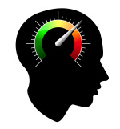

# Echange d'informations entre les enquêtes et les expériences [](https://www.psytoolkit.org/lessons/var_in_out.html){#var_in_out}

Il s'agit d'une fonction avancée dont vous n'avez que rarement besoin. Mais elle peut quand même être très pratique ! Les informations qui peuvent être échangées doivent être sous forme de nombres entiers. Ainsi, <u>seuls les nombres entiers peuvent être utilisés</u> (pas de lettres, pas de nombres fractionnaires).

Imaginez que vous avez une enquête dans laquelle les gens répondent d'une certaine manière et que vous voulez utiliser les réponses dans votre expérience (intégrée). Par exemple, vous pouvez demander aux personnes participant à l'enquête à quel point elles sont fatiguées sur une échelle de 1 à 10. Vous pouvez utiliser le score de "fatigue" de votre expérience pour modifier la vitesse à laquelle les stimuli sont présentés ; simplement parce que vous pouvez supposer que les personnes fatiguées ne pensent pas très vite et pourraient être stressées si l'expérience n'est pas adaptée à leur situation.

Cette leçon vous apprendra à utiliser PsyToolkit pour faire ce qui suit :

* réaliser une enquête en ligne avec une expérience intégrée
* obtenir une réponse de l'enquête sur l'expérience
* introduire une variable de l'expérience dans l'enquête

## Comment cela fonctionne-t-il ?[](https://www.psytoolkit.org/lessons/var_in_out.html#_how_it_works){#how_it_works}
Il vous suffit d'ajouter une ou deux options à l'expérience à laquelle vous souhaitez envoyer des informations issues de l'enquête ou l'inverse.

## Comment le faire pas à pas [](https://www.psytoolkit.org/lessons/var_in_out.html#_how_to_do_it_step_by_step){#how_to_do_it_step_by_step}

## Étape 1. L'exemple de plan d'expérience [](https://www.psytoolkit.org/lessons/var_in_out.html#_step_1_the_example_experimental_design){#step_1_the_example_experimental_design}

Imaginez que nous ayons une enquête dans laquelle nous demandons aux gens à quel point ils sont fatigués. Puis nous menons une expérience qui utilise le score de fatigue pour leur donner plus de temps pour répondre. L'expérience renvoie le temps de réponse moyen à l'enquête.

Quoi que vous fassiez, vous devez d'abord réfléchir à ce que vous voulez faire. Dans le dessin ci-dessous, le jaune représente les questions de l'enquête et le vert, l'expérience intégrée.


## Étape 2. Mettre en place une enquête [](https://www.psytoolkit.org/lessons/var_in_out.html#_step_2_setup_a_survey){#step_2_setup_a_survey}

````
l: tired
t: range
q: How tired are you?
- {min=1,max=10,start=5,left=not tired,right=very tired}

l: mytask
t: experiment
- speed_measure

l: myfeedback
t: info
q: Your tiredness on a scale from 1 to 10 was {$tired}.
Your average response speed was {$speed_result}
````

Veuillez noter ce que : 

- Il y a trois types de "questions" dans cette enquête : range, experiment et info 
- Vous devez faire une expérience appelée "speed_mesure" 
- Notez que dans la partie *q:* d'une question, vous pouvez utiliser des variables. La variable {\$tired} est simplement la réponse donnée à la première question 
- La variable {\$speed_result} est tirée de l'expérience. La variable {\$speed_result} est tirée de l'expérience. Dans l'expérience, la variable globale *&speed_result* est envoyée

## Étape 2. Mettre en place une expérience [](https://www.psytoolkit.org/lessons/var_in_out.html#_step_2_setup_an_experiment){#step_2_setup_an_experiment}

Vous pouvez mettre en place n'importe quelle expérience pour cela, à condition de vous assurer que les lignes suivantes font partie des options de l'expérience :

````
options
  var in tired
  var out speed_result
````
## Exécution du code [](https://www.psytoolkit.org/lessons/var_in_out.html#_running_the_code){#running_the_code}

Ici, vous pouvez voir ce que fait cette enquête et cette expérience. On vous demande d'abord si vous êtes fatigué. Ensuite, cette variable est utilisée dans l'expérience. Il vous suffit d'appuyer sur la touche b aussi vite que possible lorsque l'on vous le demande. Plus vous avez de temps, plus vous dites que vous êtes fatigué (vous obtenez 1000 ms + 100 ms supplémentaires pour chaque point de fatigue, vous pouvez donc obtenir jusqu'à 2000 ms de plus)

<div align="center">

[](https://www.psytoolkit.org/cgi-bin/psy2.5.1/survey?s=mpXV3)

**Tester le questionnaire**
</div>
  
## Code PsyToolkit [](https://www.psytoolkit.org/lessons/var_in_out.html#_the_psytoolkit_code){#the_psytoolkit_code}

````
options
  var in tired
  var out speed_result

fonts
  arial 18

task quick
  keys b
  set &my_max_speed expression 1000 + &tired * 100
  show rectangle -200 -200 30 30   255 255 0
  show rectangle -200  200 30 30   255 255 0
  show rectangle  200 -200 30 30   255 255 0
  show rectangle  200  200 30 30   255 255 0
  show text "Press the b key, please"
  readkey 1 &my_max_speed
  clear 1 2 3 4 5
  if STATUS == 1
     show text "Well done! Your response time ="
     show text RT 0 100
     delay 1000
     clear -1
  fi
  if STATUS == 3
     show text "Too slow. Are you tired?"
     delay 1000
     clear -1
  fi
  save STATUS RT

block test
  tasklist
    quick 10
  end
  feedback
    text align left
    set &speed_result mean c2 ; select c1 == 1
    text -200 -200 &tired ; prefix "You tiredness score from survey was: "
    text -200 -50 &my_max_speed ; prefix "Your maximally allowed speed: "
    text -200 100 &speed_result ; prefix "Your speed in correct trials: "
    text -200 200 "Press space bar to continue"
  end
````

 [Télécharger le code](https://www.psytoolkit.org/lessons/speed_measure.zip)

Si vous indiquez une variable comme *var out*, elle sera automatiquement disponible ensuite dans l'enquête et dans le tableau de donnnées téléchargeable. Ceci est particulièrement utile si vous n'êtes pas intéressé par une analyse plus poussée des données "brutes". Cela arrive parfois. C'est une façon d'utiliser simplement certaines informations issues de l'expérience et de les transmettre très facilement au questionnnaire.
