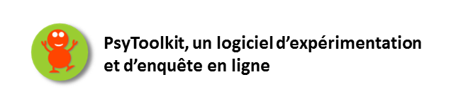

--- 
title: 'Documentation en ligne de PsyToolkit'
author: Gijsbert Stoet, Jean-Marc Meunier (Trad)
date: "`r Sys.Date()`"
output:
  word_document: default
  pdf_document: default
description: Ce ebook est une traduction de la documentation de PsyToolkit
documentclass: book
link-citations: yes
bibliography:
- book.bib
- packages.bib
site: bookdown::bookdown_site
biblio-style: apalike 
---

# {-}

## Note du traducteur{-}

PsyToolkit est un logiciel deux-en-un permettant de faire des expériences de psychologie et de faire des enquêtes en ligne. A  notre connaissance, il n'existe pas d'autre dipositif gratuit pour l'expérimentation. Pour les questionnaires, l'offre est en revanche pléthorique, alors pourquoi prendre du temps pour apprendre à utiliser un nouvau dispositif ? Parce que psyToolkit permet des choses que ne permettent pas les autres logiciels d'enquête en ligne : 

- aléatorisation de l'ordre des items dans une question, des questions ou blocs de questions
- enregistrement des temps de réponse
- Calcul des variables en cours de passation et affichage de feedbacks
- affichage d'une ou plusieurs images, sons ou vidéos dans une question
- intégration d'une expérience dans un questionnaire
- génération automatique de code pour le retest
- Archivage des enquêtes et expériences à des fins de partage ou d'enseignement

COnsidérant ces quelques caractéristiques (et il y en a bien d'autres), il m'est apparue indispensable de former nos étudiants à un tel outil pour leur donner accès à un conception professionnelle de leurs enquêtes et expériences.C'est pourquoi j'ai entrepris la traduction de la documentation de PsyToolkit durant mes congés d'été et intégrer l'usage de PsyToolkit dans mes cours de licence et de master et dans mes recherches. Je n'ai pas traduit la totalité de la documentation et me suis concentré sur ce qui semblait devoir m'être utile. Certaines parties sont encore en cours de traduction et seront publiées au fur et à mesure. A chaque paragraphe, j'ai indiqué à l'aide d'une icône cliquable le lien vers le paragraphe original dans la documentation anglaise. 

Je me suis permis également de structurer un peu différemment la documentation tout en conservant dans la mesure du possible les liens entre les différentes sections. Cela tient avant tout au fait que ce document est un support de cours pour moi. L'enchainement des chapitres suit donc la progression que je souhaite suivre avec mes étudiants. 

Je n'ai pas la prétention de proposer une traduction parfaite, ni exhaustive. Elle comporte sûrement des erreurs et des coquilles que je corrigerai si vous voulez bien me les signaler. Je suis ouvert également à des propositions, voir à un coup de main pour la traduction (notamment pour sous-titrer les vidéos dans les leçons). Pour tout cela, vous pouvez utiliser [**le fil d'annotation**](https://hyp.is/go?url=https%3A%2F%2Fjmeunierp8.github.io%2FPsytoolkit%2F&group=__world__). Pour faire des annotations, [le tutoriel est ici](https://jmeunierp8.github.io/Guide-utilisateur-Hypothesis/s3.html). Chacun pourra ainsi consulter les commentaires et propositions de correction. En cas de doute ou d'incompréhension d'un passage, n'hésitez pas à le consulter ou à regarder la section originale en anglais. 

La traduction des bibliothèque de questionnaires et d'expériences a été entreprise par ma collègue Elisabetta Zibetti et sera bientôt ajoutée à ce document. 

Ce document est mis à disposition de la communauté avec l'accord de l'auteur et sous licence creative commons CC-BY-Nc. Cela signifie que vous pouvez l'utiliser sans le modifier, en citant l'auteur et les traducteurs et que les utilisations commerciales ne sont pas autorisées. 

Pour citer ce document, utilisez la référence suivante :

- Stoet, G. (2020) Documentation de PsyToolkit (version 3.2.0), J.M. Meunier & E. Zibetti, Trad. [https://jmeunierp8.github.io/Psytoolkit/](https://jmeunierp8.github.io/Psytoolkit/)

Nous rappelons par ailleurs qu'à la demande de l'auteur,  pour utiliser PsyToolkit, vous devez citer les deux articles suivants : 

- Stoet, G. (2010). PsyToolkit - A software package for programming psychological experiments using Linux. Behavior Research Methods, 42(4), 1096-1104. http://link.springer.com/article/10.3758%2FBRM.42.4.1096

- Stoet, G. (2017). PsyToolkit: A novel web-based method for running online questionnaires and reaction-time experiments. Teaching of Psychology, 44(1), 24-31. https://journals.sagepub.com/doi/abs/10.1177/0098628316677643?journalCode=topa

